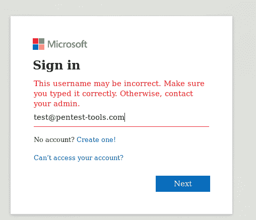
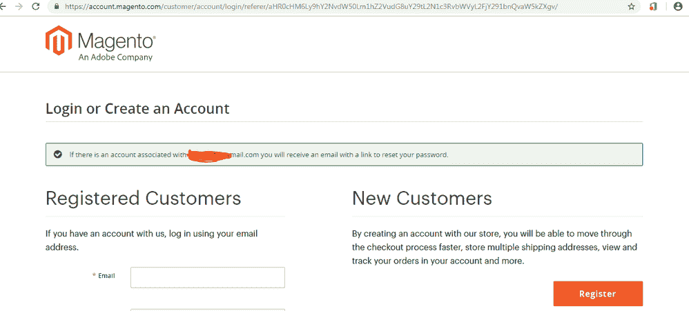

# 渗透测试中账户计数的 6 个技巧[包括演示]| Pentest-Tools.com

> 原文：<https://pentest-tools.com/blog/account-enumeration-techniques-pentesting#2022-07-10T02:54:59.000Z>

枚举是帮助你在目标生态系统中获得立足点的基本策略之一。作为一名渗透测试人员，如果你正确地进行了枚举，你可以获得很大的速度并更彻底地准备你的开发阶段。

这就是为什么我们在本指南中专门介绍了在 pentest 项目中获取有效用户帐户的用户名或电子邮件地址的方法。

## **为什么帐户枚举在渗透测试中很重要？**

如果应用程序不能正确地验证其数据库中用户名/电子邮件地址组合的存在，未经授权的行为者可以轻易地欺骗系统“泄露有关产品操作或内部状态的信息”

根据社区开发的常见弱点列举列表 CWE 的说法，这一安全缺陷——[CWE-203:可观察到的差异](https://cwe.mitre.org/data/definitions/203.html)——揭示了保护不力的资源，作为一名 pentester，您可以使用这些资源来建立与目标的活动连接。

在现实世界中，它允许攻击者获取应用程序或软件中包含的有效用户名列表，他们将使用该列表对获取的帐户发起暴力、字典或密码喷射攻击。

这个安全问题之所以成为关注的焦点，是因为许多组织接受它，因为它改善了用户体验。然而，其广泛传播和高度可利用的特性使得恶意行为者能够系统地收集关于目标的信息，从而使他们的攻击变得特别恶毒。

让我们来看一下用于枚举有效用户标识符(用户名或电子邮件地址)的最常用技术:

1.  账户枚举通过**登录错误信息不符**

2.  通过**忘记/重置密码功能**进行账户枚举

3.  通过**登记表**进行账户枚举

4.  通过**响应时间差异**进行账户枚举

5.  通过**响应大小差异**进行账户枚举

6.  通过**账户锁定消息**进行账户枚举

我还包括了这些策略的视频演示，帮助你尽快从理论走向实践。

## **1。通过登录错误信息差异进行账户枚举**

这是大多数 web 应用程序中最常见的用户枚举方法之一。当应用程序用不同的消息来响应数据库中是否存在用户名时，您可以利用这一点。

当用户名或电子邮件地址在数据库中时，您会收到一条“密码无效”的消息。

如果找不到用户名或电子邮件地址，您会收到一条“用户名无效”的消息。

Office365 身份验证页面提供了一个通过登录页面枚举用户名的著名示例。*为什么还在？*因为考虑到用户体验和工作流程，微软认为这是一个可以接受的风险。

*急于想知道如何进入该屏幕？*看看这个解释这个问题的视频演示:

<template x-if="showVideo"></template>

**如何通过登录错误信息差异缓解账户枚举**

对于这种类型的用户名枚举，推荐的解决方案是**显示一条通用消息**，而不管用户名是否存在于数据库中。这就是为什么作为互联网用户，你可能会看到“用户名或密码无效”的消息。

您可以在您的[测试报告](https://pentest-tools.com/usage/pentest-reporting-tool)中向您的客户推荐这种缓解方法。

 [来源](https://github.com/login)

## **2。通过忘记/重置密码功能枚举账户**

我的第二个方法是检查应用程序是否有忘记或重置密码的功能。

您会注意到，大多数 web 应用程序只允许您输入与用户名相关的电子邮件地址，如果它们提供基于电子邮件的认证机制，这将很有帮助。如果你幸运的话，该应用程序将允许你填写用户名*或*电子邮件地址。

这种类型的枚举发生在下列情况下:

*   您在数据库中输入一个用户名或电子邮件地址*是*，

*   该应用程序将向您显示“密码重置令牌已发送到与您的帐户相关的电子邮件”的绿色消息。

*   或者，你输入一个用户名或电子邮件地址，而数据库中的*不是*，那么应用程序会告诉你“用户名或密码无效”

让我们看看这是如何工作的:

<template x-if="showVideo"></template>

### **如何通过忘记/重置密码功能减少账户枚举**

这种类型的枚举的修复实际上很简单，与第一种类似。显示相同类型的通用消息——“如果用户名/电子邮件有效，则会向您的电子邮件发送一个密码链接”——即使该用户名或电子邮件是否存在于应用程序的数据库中。

 [来源](https://community.magento.com/t5/Magento-2-x-Technical-Issues/Magento-Main-Website-Password-Reset-Link-Not-Receiving/td-p/121226)

## **3。通过登记表进行账户枚举**

在 pentesting 时，您可以通过在 web 应用程序的注册页面上**填写有效的电子邮件地址或用户名来找到它。(你可以通过各种方式获得电子邮件地址或用户名，比如在组织本身上做 [OSINT](https://en.wikipedia.org/wiki/Open-source_intelligence) ，或者使用单词表。)当应用程序返回“现有用户名”或“现有电子邮件”错误消息时，你就知道这是有效的。**

点击“播放”观看简单明了的快速演示:

<template x-if="showVideo"></template>

### **如何通过注册表减轻账户枚举**

如果输入的用户名/电子邮件已被占用，您可以在 pentest 报告中包含的此类枚举的建议缓解措施是显示一条通用消息，如下所示:

“您的注册出错。

错误的原因可能是:

*   用户名无效或已被使用。选择另一个用户名。

*   密码长度无效。使用较长的密码。

*   密码不匹配。请重新输入密码，以确保输入正确。

*   您输入的电子邮件地址已经注册或无效。使用另一个电子邮件地址。

*   验证码无效。正确填写验证码的答案。

*   您尚未同意服务条款。确保您同意服务条款，并选中下面适用的复选框。

请更正注册中的任何错误，然后重试。

出于安全原因，我们不会透露注册失败的原因。"

这最后一句话会让你赢得你的客户的好感，因为他们会阅读所有这些细节，并千方百计地登录并使用该应用程序。

## **4。通过响应时间差异进行账户枚举**

这种策略并不常见，我在许多渗透测试人员使用的方法中见过它的缺失。

您可以检查 web 服务器的响应时间，并注意当您在登录页面、忘记密码页面或注册表单中提供有效或无效的用户名时，响应时间是否有任何差异(相当大或模式)。

为了测试这一点，我建议用有效的用户名连续发送 **3 个请求，并记下响应时间。之后，用一个*无效的*用户名发送另外 3 封邮件，但是确保**在用户名或电子邮件**中更改一个字母/数字。**

例如，如果您拥有有效用户“admin ”,并且您收到了以下响应时间——475 毫秒、328 毫秒、406 毫秒——则使用无效用户“bdmin”。如果您收到以下响应时间——779 毫秒、821 毫秒、944 毫秒——您可以清楚地注意到，当用户名有效时，应用程序的响应速度是原来的两倍。

让我们看看这是如何工作的:

<template x-if="showVideo"></template>

### **如何通过响应时间差异缓解账户枚举**

安全团队应该专注于实现固定的响应时间或使用随机的响应时间，以防止攻击者发现他们可以利用该漏洞来访问系统。

确保保留这份建议列表，并在结束约会时将它们添加到您的 pentest 报告中。

## **5。通过响应大小差异进行帐户枚举**

前一种方法使用的相同模式也适用于这种情况。一个彻底的圣灵降临者总是会寻找行为(技术或人类)中最细微的差异，以找到“王国”的钥匙正如他们所说，魔鬼在细节中，没有人比渗透测试人员更了解这一点。

举例来说，有时即使用户名存在或不存在，应用程序也可以显示相同的通用消息，但是响应大小可以不同，甚至一个字节也可以不同。要在 pentest 工作流程中使用它，您可以直接在浏览器中**检查响应大小。**

播放此演示，了解如何操作:

<template x-if="showVideo"></template>

### **如何通过响应大小差异缓解账户枚举**

在您的 pentest 报告中，建议目标的所有者部署一个**固定响应大小**,无论用户名是否存在，以避免向未授权——和干涉——的外部人员透露此详细信息。

## **6。通过账户锁定消息进行账户枚举**

要测试这种类型的枚举，请按照下列步骤操作:

1.  使用有效的用户名或电子邮件地址发送请求，以确认锁定阈值。

2.  发送所需的请求，直到达到阈值。

3.  如果用户名存在，系统会提示您一条类似“您的帐户被阻止”的消息但是，如果它不存在，您仍然可以发送请求，应用程序不会显示锁定错误。

这是一个风险，因为在您测试此问题时，它可能会阻止提供的帐户。

实际上，让我们看一下这个演示，逐步了解一下概况:

<template x-if="showVideo"></template>

### **如何通过账户锁定消息缓解账户枚举**

这个问题的解决方案非常简单:无论谁负责补救，都应该让**停止显示锁定消息**。您可以将另一种见解融入展示您的工作和成果的 pentest 报告中。

## **账户枚举缓解备忘单**

为了在您的工作流程中快速集成这些帐户枚举方法，我准备了一份包含基本建议的测试备忘单:

| **账户枚举战术** | **缓解** |
| --- | --- |
| **登录错误信息不符** | 无论用户名是否存在，都显示通用消息: |
| **忘记/重置密码功能** | 无论用户名是否存在，都显示通用消息: |
| **登记表** | 显示通用信息以及针对最常见使用情形的潜在解决方案: |
| **响应时间差异** | 实施固定响应时间或使用随机响应时间。 |
| **响应大小差异** | 无论用户名是否存在，都部署固定的响应大小。 |
| **账户锁定信息** | 停止显示锁定消息。 |

下次之前，看看我在博客上发布的其他[测试指南](/blog/authors/pentest-cristian)，如果有你想让我写的特定主题，请告诉我。