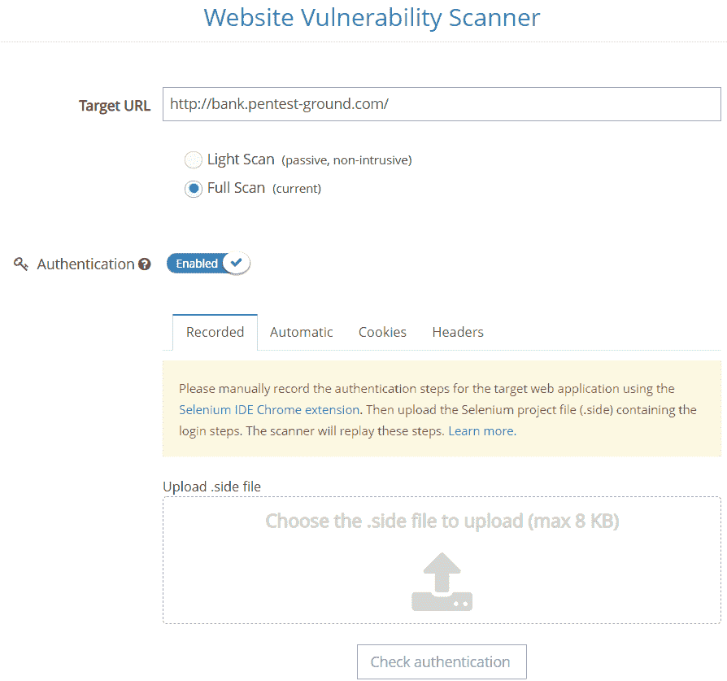
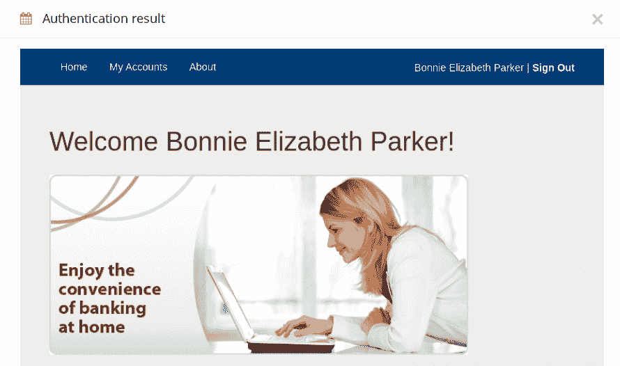
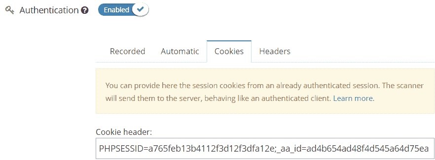
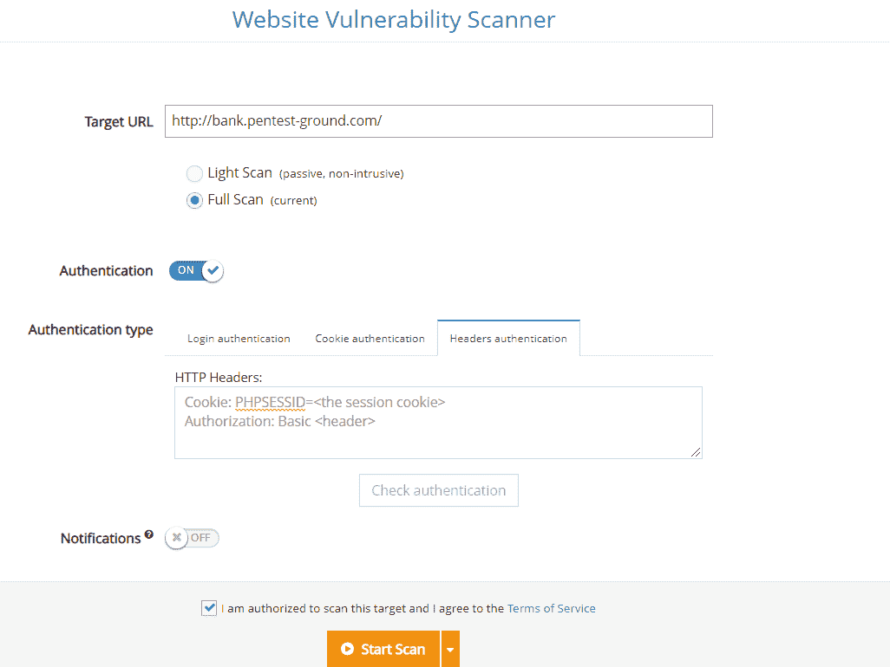
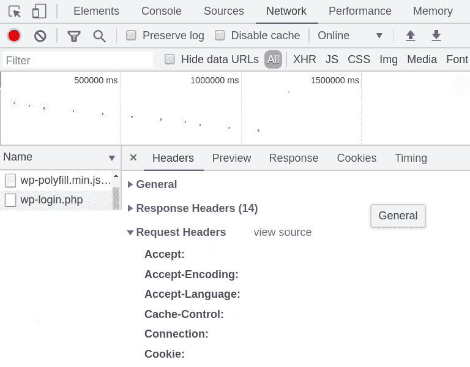

# 如何使用 Pentest-Tools.com | Pentest-Tools.com 执行认证网站扫描

> 原文：<https://pentest-tools.com/blog/authenticated-scanning#2022-08-17T10:01:59.000Z>

本文展示了如何使用[网站漏洞扫描器](https://pentest-tools.com/website-vulnerability-scanning/website-scanner)工具扫描需要认证的 web 应用程序。

了解如何配置扫描仪的认证选项，使其自动通过登录页面并执行*深度扫描*。

**注意:**要访问扫描仪的认证选项，您需要首先登录您的 Pentest-Tools.com 账户[。](https://pentest-tools.com/login)

## 一.为什么要进行认证扫描？

如果未启用身份验证，web scanner 只覆盖一小部分应用程序功能，即在用户必须进行身份验证之前公开的功能。但是，可能还有其他未发现的漏洞，这些漏洞只能在登录到应用程序后才能发现。

[执行认证扫描](https://www.youtube.com/watch?v=C52vwMdTDqA&t)的另一个很好的理由是，它模仿恶意认证用户的活动，这具有额外的攻击媒介。经过身份验证的用户比未经身份验证的用户可以访问更多的功能。

## **二。支持的认证方法**

我们的[网站漏洞扫描器](https://pentest-tools.com/website-vulnerability-scanning/website-scanner)支持四种执行认证扫描的方法:

1.  [**记录-基于记录的认证**](/blog/authenticated-scanning/#recorded)

2.  [**自动-基于表单的认证**](/blog/authenticated-scanning/#form)

3.  [**Cookie——基于 Cookie 的认证**](/blog/authenticated-scanning/#cookie)

4.  [**报头–报头认证**](/blog/authenticated-scanning/#headers)

本文的以下部分向您展示了如何配置扫描器，以及如何在进行身份验证扫描时解释结果。

网站漏洞扫描程序提供两种类型的扫描:轻度扫描和完全扫描。只有**全扫描**支持认证。

这是扫描仪的 web 界面，允许您配置身份验证选项:

为了配置全扫描的身份验证，您必须:

1.  插入您要扫描的网站的 URL(目标)

2.  Select the Full Scan

3.  启用“身份验证”选项

### **1。基于记录的认证**

复杂的 web 应用程序需要加载动态页面和组件的能力。对于能够在特定目标上进行身份验证的自动扫描器，必须满足这些要求。Recorded 方法使用 Selenium 技术在登录用于扫描的帐户时记录用户事件。用户必须上传认证过程的记录，该记录可以按照下面描述的步骤获得。

要了解启用此身份验证方法所需步骤的更多信息，[请阅读我们的专用支持文章](https://support.pentest-tools.com/en/scans-tools/recorded-authentication-selenium)。

<template x-if="showVideo"></template>

### **2。自动-基于表单的认证**

“自动”选项允许用户通过在目标应用程序中拥有一对有效的凭证来进行认证扫描。

该方法在用户提供的 URL 中找到登录表单，发送凭证，并截屏响应。
通过选择**自动**选项卡进行配置。

您必须提供以下详细信息:

此时，您可以通过按下`Check Authentication`按钮或直接开始扫描来测试验证是否正常工作。检查身份验证功能不会启动扫描过程，但无论成功与否，它只会从浏览器显示一个屏幕截图。(以 1280 x 720px 像素裁剪)。

以下是“自动”选项的配置示例:

这是一个成功登录的屏幕截图示例，显示了目标应用程序的登录页面。

### **3。基于 Cookie 的认证**

[HTTP cookie](https://en.wikipedia.org/wiki/HTTP_cookie)是网络浏览器从服务器接收的数据片段，通常用于识别用户的网络会话(它们也被称为会话 cookie)。收到会话 cookie 后，浏览器会将它与向该服务器发出的每个 HTTP 请求一起发送。知道请求与特定用户相关联是很有帮助的。

我们的**基于 cookie 的认证**选项模仿已经有会话 Cookie 的 web 浏览器的行为。它要求用户在“cookie 头”字段中插入有效的会话 Cookie。会话 cookie 必须取自已经建立的 web 会话(您需要手动登录到您的 web 应用程序并从浏览器获取 cookie)。

此类身份验证的 web 界面如下图所示:

为了获得需要的饼干，请从 [**这里开始按照**](/blog/authenticated-scanning/#sessioncookie) 的步骤操作。

HTTP 头支持客户端和服务器之间的通信，携带关于客户端浏览器、服务器、访问的页面等信息。一些应用程序使用特定的头为用户(登录)创建会话。因此，需要扫描这些类型的网站/应用程序(身份验证)的用户需要标头的身份验证方法。

基于 cookie 的方法使用 cookie，这是一种特殊类型的头，但并不是每个应用程序都使用 cookie 来验证用户。有些应用程序依赖其他特殊的头作为附加的安全层，例如基于令牌的认证( [**JSON web 令牌)**](https://jwt.io/)

为了检索所需的标题，请遵循上一节中描述的相同步骤(基于 cookie ),并按以下格式插入它们:

header 1:header 1 的值

header 2:subheader 1 = subheader 1 的值；子标题 2 =子标题 2 的值

## **三。如何获取会话 cookie？**

首先，您必须使用 web 浏览器在目标 web 应用程序中手动进行身份验证。其次，您需要从浏览器获取会话 cookie 字符串。

例如，使用 **Google Chrome** ，您执行了以下操作:

*   进入开发者工具–通过菜单>更多工具>开发者工具(或 Ctrl + Shift + I)

*   进入“网络”选项卡

*   单击“名称”部分，选择显示附加“Cookies”选项卡的 URL。

*   转到“标题”选项卡(针对该 URL)

*   滚动到请求标题并查看 Cookie 标题

*   从 Cookie 头中复制字符串，并将其插入，如下例所示。*aa*id = ad4b 654 ad 48 F4 d 545 a 64d 75 ea’(名称=值的列表，用“；”分隔)并且没有空格)

以下是开发人员工具界面:

## **四世。解读结果**

经过身份验证的扫描比未经身份验证的扫描覆盖更多的应用程序功能和页面。“检查认证”按钮对于前三种方法是**可选的，对于**“Headers”**方法**是禁用的**，因此您可以直接开始扫描。**

如果您在最终扫描报告中获得额外的“身份验证完成”消息，您将知道身份验证成功。此外，蜘蛛结果应该包含比未经验证的扫描更多的抓取的 URL。

**认证扫描显示的结果**

 **未认证扫描显示的结果**

## **五、幕后**

web 漏洞扫描的主要步骤阶段是爬行和主动扫描。为了以经过身份验证的用户身份执行这些操作，扫描程序需要用户的会话 cookie。它将用于每一个请求，它将发现比未经验证的扫描更多的信息。

**登录认证**选项执行一个额外的步骤，以获取会话 cookie。首先，扫描程序从提供的 URL 中检测登录表单，并尝试使用凭据进行身份验证。第二，扫描程序试图从经过身份验证的用户那里获取会话 cookie，并从这一点开始在每个请求中使用它。

如果您只选择了`Check authentication`选项，用户页面的屏幕截图将帮助您直观地了解身份验证是否成功。蜘蛛搜索未初始化，扫描停止。

在**基于 cookie 的认证**中，你已经提供了会话 Cookie，蜘蛛搜索和主动扫描直接开始。如果 cookie 是正确的，扫描将导致发现更多的 URL 并分析漏洞。

请注意，扫描仪无法知道提供的 cookie 是否正确。它将按原样使用它，并且由您来验证扫描是否到达了应用程序的所需部分。

## 六。兼容性

我们目前还支持在单页应用程序(spa)上执行身份验证测试，因为我们的网站扫描仪已经升级，因此它能够加载、检测和登录给定凭据的用户。该方法可使用基于 [**形式的认证**](/blog/authenticated-scanning/#form) 方法和基于记录的认证 [**基于记录的认证**](/blog/authenticated-scanning/#recorded) 。

随着基于标头的身份验证的实施，我们的网站漏洞扫描器现在可以基于令牌(JWT)为应用程序提供更准确的评估和增强的安全性。

您可以在我们的支持中心找到关于如何使用 JWT 执行认证网站扫描的分步指南。

**使用认证扫描测试您的 web 应用程序以发现隐藏的漏洞**

身份验证扫描在 web 应用程序中提供了更多的覆盖范围，因为它发现了更多的动态 URL。当您执行更深入的扫描时，有更大的机会[找到隐藏良好的漏洞](https://pentest-tools.com/alltools)并使您的 web 应用程序更加安全。