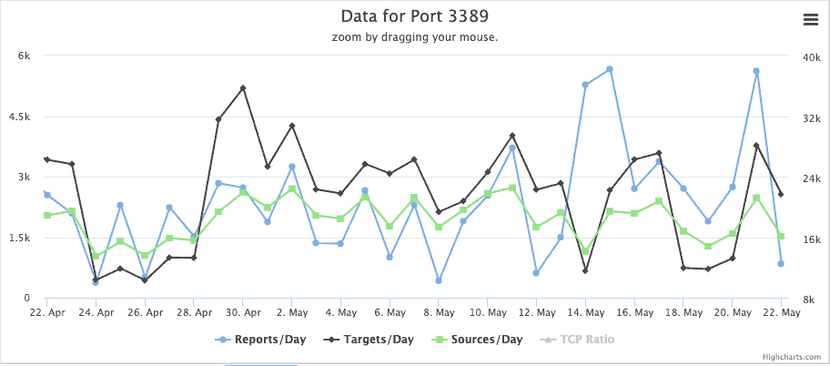

# BlueKeep，微软 RDP 漏洞-我们目前所知| Pentest-Tools.com

> 原文：<https://pentest-tools.com/blog/microsoft-rdp-vulnerability#2022-07-20T09:35:34.000Z>

BlueKeep 是微软远程桌面服务中发现的一个严重的安全缺陷，在过去的两个月里一直是头条新闻。在本文中，我们探讨了关于此漏洞的关键事实。

关于 BlueKeep，首先要知道的是，它“是可被蠕虫感染的，任何未来利用这个漏洞的恶意软件都可能从易受攻击的计算机传播到易受攻击的计算机”，微软安全响应中心(T4)说。这意味着它可以很容易地导致广泛感染，而不需要用户交互。

【**更新 2019 年 9 月 11 日**】rapid 7 项目 Metasploit 公布了 BlueKeep 漏洞的公开利用模块。我们的安全团队测试了这个 Metasploit 模块，以检查其功能并评估其正常工作的条件。我们在一个关于[如何利用 Metasploit](https://pentest-tools.com/blog/bluekeep-exploit-metasploit) 开发 BlueKeep 的分步指南中记录了我们的发现。

因此， **BlueKeep** 有可能构成类似于 [WannaCry](https://www.csoonline.com/article/3227906/what-is-wannacry-ransomware-how-does-it-infect-and-who-was-responsible.html) 勒索软件的威胁，这是迄今为止最大的网络攻击之一，它迅速传播并感染了全球超过 30 万台计算机。

下面是你将在文章中发现的内容:

## **1。关键事实:事情是这样的**

为了更好地理解这一漏洞的演变及其真正的影响，我们已经将我们所知道的关于 BlueKeep 的所有重要和相关的事实(和数据)放在了一起。

**五月的第一天**——该漏洞最初是由英国国家网络安全中心(NCSC)向微软报告的。

**2019 年 5 月 14 日**——此后不久，微软(通过向国家网络安全中心致谢)披露了此事，[发布了](https://msrc-blog.microsoft.com/2019/05/14/prevent-a-worm-by-updating-remote-desktop-services-cve-2019-0708/)针对关键远程代码执行漏洞 BlueKeep 的紧急 parch，官方名称为 [CVE- 2019-0708](https://cve.mitre.org/cgi-bin/cvename.cgi?name=CVE-2019-0708)

**2019 年 5 月 17 日**——几天后，在一份每周威胁报告中，英国国家网络安全中心[敦促](https://www.ncsc.gov.uk/report/weekly-threat-report-17th-may-2019)组织和个人立即应用微软的安全补丁，防止他们受到危害。

**2019 年 5 月 23 日**——两名安全研究人员发布了一款未经认证的[扫描仪概念验证](https://github.com/Ekultek/BlueKeep)，用于 BlueKeep，可以检测主机是否容易受到微软 Windows 远程桌面服务漏洞的攻击。关于更深入的技术细节以及如何避免 DoS(拒绝服务)攻击，你可以[阅读](https://zerosum0x0.blogspot.com/2019/05/avoiding-dos-how-bluekeep-scanners-work.html)全文。

**2019 年 5 月 28 日**——来自 Eratta Security 的安全研究人员使用了一种内部扫描工具，该工具寻找端口 3389，即 RDP 用于远程访问的端口。他们[发现](https://blog.erratasec.com/2019/05/almost-one-million-vulnerable-to.html#.XTgazx0zaUl)互联网上大约有 950，000 台易受此漏洞攻击的机器。

根据[互联网风暴中心(ISC)](https://isc.sans.edu/forums/diary/An+Update+on+the+Microsoft+Windows+RDP+Bluekeep+Vulnerability+CVE20190708+now+with+pcaps/24960/) (一个由 Sans 研究所负责监控互联网上恶意活动水平的计划)，没有观察到端口 3389/TCP 扫描的大幅增加。然而，ISC 指出:“这个端口被扫描得相当严重，即使没有新的漏洞引起人们的注意”。

使用在线 [**端口扫描工具**](https://pentest-tools.com/network-vulnerability-scanning/tcp-port-scanner-online-nmap) 可以帮助您轻松发现哪些网络服务暴露在互联网上，并获得包括开放 TCP 端口和服务的[网络攻击面](https://pentest-tools.com/features/attack-surface)的概述。

**2019 年 5 月 30 日**——两周后，在微软最初发布 Bluekeep 的安全补丁后，该公司又回来强调为受影响的系统安装最新更新的重要性。

**2019 年 6 月 4 日**——另一份来自国家安全局的建议强烈[建议](https://www.nsa.gov/Press-Room/News-Highlights/Article/Article/1865726/nsa-cybersecurity-advisory-patch-remote-desktop-services-on-legacy-versions-of/)微软 Windows 管理员和家庭用户申请并使用最新的可用软件补丁，以避免成为容易的目标。

同一天，CERT 协调中心 ar 卡耐基梅隆大学报告了另一个相关的微软 Windows RDP 安全漏洞(称为 CVE-2019-9510)，该漏洞可以允许攻击者远程绕过 Windows 锁屏。更多(技术)细节可以在[这里](https://www.kb.cert.org/vuls/id/576688/)找到。

**2019 年 6 月 17 日**——来自网络安全和基础设施安全局(CISA)的安全专家随后发布了[一个活动警报，供 Windows 用户和管理员修补关键的安全漏洞，并“尽快采取适当的缓解措施”。国土安全部的网络机构表示，他们已经测试了一个有效的 BlueKeep 远程代码执行漏洞，并得出结论，Windows 2000 机器也容易受到这一缺陷的攻击。](https://www.us-cert.gov/ncas/alerts/AA19-168A)

**2019 年 7 月 1 日**——Sophos 的安全研究人员开发了一个[概念验证](https://news.sophos.com/en-us/2019/07/01/bluekeep-poc-demonstrates-risk-of-remote-desktop-exploit/)漏洞利用(不向公众开放)，他们在视频中展示了恶意行为者如何利用 BlueKeep 漏洞攻击 RDP 服务器，以及为什么它是一个严重的威胁，敦促个人和组织尽快修补他们的系统。

**2019 年 7 月 23 日**——一家总部位于美国的公司 Immunity Inc .发布了一个名为 [CANVAS 7.23](https://www.immunityinc.com/products/canvas/) 的工作 BlueKeep 漏洞，这是他们渗透测试工具包的一个新模块部分。这里可以看到视频演示[。](https://vimeo.com/349688256/aecbf5cac5)

## **2。关于 BlueKeep** 的技术细节

BlueKeep 的根本原因似乎是 termdd.sys RDP 内核驱动程序中存在的[释放后使用](https://www.purehacking.com/blog/lloyd-simon/an-introduction-to-use-after-free-vulnerabilities) (UAF)条件，未经验证的攻击者可以远程利用该条件。

攻击者可以通过尝试到目标服务器的 RDP 连接来执行此操作，打开“MS-T120”虚拟通道以便向其发送精心编制的数据。

代码尚未公开发布，但最近的这篇技术文章描述了如何利用 BlueKeep 漏洞。你也可以在这里找到到目前为止发现的蓝牙扫描仪和漏洞的轨迹。

在中国举行的 2019 安全发展大会上，一名安全研究员[向](https://github.com/blackorbird/APT_REPORT/blob/master/exploit_report/%23bluekeep%20RDP%20from%20patch%20to%20remote%20code%20execution.pdf)展示了一份关于如何利用 BlueKeep 的演示。

下面是另一个演示视频，展示了如何利用该漏洞以 NT AUTHORITY\SYSTEM 权限在易受攻击的机器上获取系统外壳。

<template x-if="showVideo"></template>

这仍然只是用于测试和教育目的，而不是针对目标，但它证明了只要付出一点努力和一些技术技能，易受攻击的机器就可以被利用**,如果它们没有应用最新的补丁。**

对于那些想深入了解更多技术细节的人，我们也建议查看 MalwareTech 的分析。

虽然没有公开利用的证据出现，但其他安全专业人员也一直在开发他们自己的 PoC 利用:[这里](https://github.com/Ekultek/BlueKeep)和[这里](https://github.com/nccgroup/Cyber-Defence/blob/master/Signatures/suricata/2019_05_rdp_cve_2019_0708.txt)针对 BlueKeep 漏洞，以提高意识并帮助组织和普通用户加强他们的防御。

关于受影响的 Windows 计算机，该列表包括 Microsoft 系统的旧版本，例如:

*   Windows 2003

*   Windows XP

*   Windows 7

*   Windows Server 2008

*   Windows Server 2008 R2 版

微软不再支持的这些平台的安全更新可以在这里找到[我们建议立即应用它们。](https://support.microsoft.com/en-us/help/4500705/customer-guidance-for-cve-2019-0708)

运行 Windows 8 和 Windows 10 的电脑不受该漏洞影响，最新版本的 Windows 也是如此。

## **3。保护您数据的安全措施**

我们建议组织和用户避免暴露于 BlueKeep 漏洞:

1.  **定期安装最新的安全更新**，这将有助于最大限度地减少黑客发现您系统中的漏洞并利用它们来危害敏感数据的机会。补丁可以从[这里](https://support.microsoft.com/en-us/help/4500705/customer-guidance-for-cve-2019-0708)下载。

2.  **限制**(尽可能)访问或**禁用**(如果不使用)**远程桌面服务**以减少暴露于此安全漏洞。

3.  创建并使用防火墙来限制远程桌面访问，以便只有特定的 IP 地址可以访问特定的设备。相反，尝试 RDP 网关，它提供了额外的保护层。

4.  [启用网络级身份验证](https://en.wikipedia.org/wiki/Network_Level_Authentication)，提供额外的身份验证措施并增强安全性，使攻击者无法轻易登录。

## **4。了解微软 RDP 漏洞并优先打补丁**

也许我们应该从 BlueKeep 漏洞中吸取的一个重要教训是安装安全补丁和定期更新计算机系统的重要性。

安全专业人士有些担忧，他们认为类似 WannaCry 的勒索病毒爆发可能在未来几周或几个月内迫在眉睫。这就是为什么他们强烈建议和提醒公司和家庭用户及时更新他们的 Windows 系统。

据 BitSight 的[研究团队称，虽然自可蠕虫化的 Windows 远程桌面缺陷被揭露以来已经过去了两个多月，但仍有大约 **805，665 个系统**未打补丁，容易受到 BlueKeep 的攻击。](https://www.bitsight.com/blog/industry-response-to-bluekeep-vulnerability?utm_campaign=public-relations&utm_source=public-relations&utm_medium=referral)

让我们记住，安全性应该是每个人的议程，也是更好地保护我们所有数字资产的重中之重。