# 如何进行全面的网络漏洞评估| Pentest-Tools.com

> 原文：<https://pentest-tools.com/blog/network-vulnerability-assessment#2022-09-07T10:21:05.000Z>

最优秀的道德黑客建立和维护一个杰出的工作流程和过程，因为它的回报-大时间！

当你总是被工作压得喘不过气来时，很难腾出时间来调整和改进，即使我们都知道它们从长远来看有复合回报。

这就是为什么，在分解了我的[网站漏洞评估工作流程](https://pentest-tools.com/blog/website-vulnerability-assessment)之后，我正在深入研究我的网络漏洞评估流程。我为它腾出了时间，所以你不必。

在本指南中，我涵盖了**五个实际场景**来帮助你有条不紊且高效地完成整个过程。

**免责声明**:为了向您展示整个过程，我们使用我们每天都在创建和使用的漏洞扫描工具，这些工具是专为 VAPT 项目构建的。

我们首先发现网络的攻击面，然后运行特定的漏洞评估工具来执行深入扫描并发现高风险漏洞。

我将带您浏览在漏洞管理部分组织发现的过程，以展示最有影响力的发现。我将向您展示如何验证它们，筛选重要的，并调整它们的风险级别(批量)——或者忽略您不想包含在最终报告中的内容。

最后，**我将向您展示一个案例研究**，关于我如何与一起进行网络漏洞评估。

我们走吧！

**顶级提示**:首先关注公开的资产，然后使用我们的 [VPN 代理](https://support.pentest-tools.com/en/vpn-profiles/internal-network-scan-vpn-agent) 在我们的扫描机器和您的网络之间创建一个安全隧道来寻找私有/内部资产。 

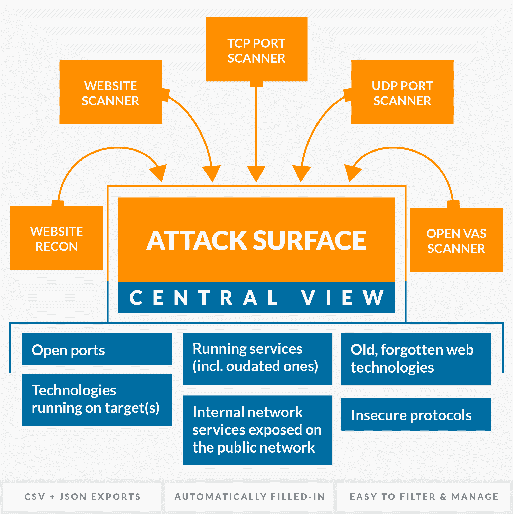

## 什么是网络漏洞评估？

没有人能免受网络攻击。这就是为什么定期获得漏洞评估报告以识别组织中的高影响安全问题是至关重要的。

网络漏洞评估是识别一个或多个端点中的安全漏洞的过程。在对这些问题进行详细分析后，执行评估的信息安全专家会根据预定义的风险制定补救计划。

**预定义风险**是业务定义的指标，其中高优先级资产基于业务影响和与发现的漏洞相关联的风险分值进行分类。

由于网络的复杂性和具体组件各不相同，渗透测试专家或网络安全顾问(尤其是安全团队)拥有正确的流程和工具包非常重要。这样，他们可以更快地完成工作，并更彻底地覆盖目标基础设施中的入口点。

漏洞评估流程包括: 

*   **手动漏洞测试** -寻找网络或 web 应用程序中的错误配置

*   **网络漏洞扫描** -使用工具识别网络基础设施中的漏洞和安全缺口。 

为了获得全面、可靠的结果，您需要同时使用*和*两种方法。

未打补丁或配置不当的系统会给对手留下可乘之机，让他们利用已知的漏洞并在目标终端上投放恶意软件或勒索软件。一个恰当的例子是，对手用确切的战术攻破了 [亚马逊网络服务](https://www.darkreading.com/application-security/cloud-misconfig-exposes-3tb-sensitive-airport-data-amazon-s3-bucket)[Equifax](https://www.csoonline.com/article/3444488/equifax-data-breach-faq-what-happened-who-was-affected-what-was-the-impact.html)[NASA](https://securityboulevard.com/2019/08/a-jira-misconfiguration-exposed-employees-and-project-details-of-nasa-google-yahoo-and-many-others-alleges-grofers-lead-infra-security-engineer/)。

这就是为什么安全专家必须进行漏洞分析，以识别可能将敏感数据暴露给攻击者的安全弱点。

在我们技术生态系统的现阶段，漏洞管理流程必须是所有组织的持续活动。

然后，pentester、顾问或安全团队将向 IT 团队报告已识别的漏洞和安全缺陷，以确定组织的安全状况。确定优先级和缓解是安全评估的最后一部分，在这里，内部专家会消除关键的安全风险。

从攻击者的角度来看，在系统(例如路由器或防火墙)上执行任意代码就是成功的表现。网络漏洞评估的目标是显著降低发生这种情况的风险，因为消除这种风险是不现实的。

## 准备和进行全面网络评估时要避免的 3 个陷阱

组织认为网络是仅次于应用程序的第二大漏洞， [VMWare 全球安全洞察报告 2021](https://www.vmware.com/resources/security/global-security-insights-report-2021.html) 发现。

这就是为什么 pentesters 和安全顾问建议公司定期进行网络评估并检查安全状况。但是这个过程并不总是简单明了的。

以下是我从做大量道德黑客活动和发现第一手应该避免的事情中学到的东西。

你需要一个检查结果的过程和一个个人质量标准来衡量结果。

从我的经验来看，服务和网络指纹在识别框架或应用程序方面做得并不好。这就是为什么你需要检查整个扫描和探测流程，看看*右*漏洞模板是否在应用上运行。

在大多数情况下，您必须检查应用程序背后的所有技术，并使用适用于它的漏洞工具。

### 2.不要在没有预先计划的情况下进行网络评估

主动网络评估至关重要，但您还需要创建一份核对表，并向 IT 团队分配每天、每周或每月的任务。我建议评估和识别网络基础设施中最关键的方面，并优先考虑这些资产。因为你不能评估所有的事情。优先顺序*是关键*。

### 3.不要因为某个漏洞没有被发现就认为它不存在

您进行网络评估以发现可能暴露您的 IT 基础架构的潜在漏洞。但我了解到，尽管你进行了各种测试，但在你的环境中总有可能有某些东西未被发现。以下是我的两点意见:不要抱有虚假的安全感。采取所有必要的步骤和检查，确保尽可能多地识别关键漏洞。

## 开始网络漏洞评估的 5 种方法

我建议运行这些专用的网络安全扫描器，尽可能有效地覆盖攻击面。

**发现开放端口**

如果您想要扫描整个网络，请首先关注网络和端口发现。然后，在分析结果之后，进行漏洞扫描。

我建议按以下顺序运行这些工具:

1. **TCP 扫描仪**–端口 1-65535

2. **UDP 扫描器**–前 1000 个端口

3.根据结果，启动 [**网络漏洞扫描器**](https://pentest-tools.com/network-vulnerability-scanning/network-security-scanner-online-openvas)

4.**HTTPS 端口上的 SSL/TLS 扫描仪**(如果需要)。

### 2.使用预定义的扫描模板加快评估速度

如果你想做一个**全面而快速的漏洞扫描**，尝试一个预定义的 [**扫描模板**](https://support.pentest-tools.com/en/automation/scan-templates) 同时运行多个工具。使用它来节省时间并加快您的网络评估，其模板可在未来的项目中重复使用。

这里的一个缺点是，这些工具会在网络中产生大量流量。因此，它会产生大量噪声，并可能触发您的入侵检测系统/入侵防御系统中的一些警报。

另一个选项是创建新的扫描模板，并将以下工具与以下配置结合使用:

*   **TCP 扫描仪**–端口 1-65535

*   **UDP 扫描器**–前 1000 个端口

*   **OpenVAS TCP(全扫描)**–端口 1-65535

*   **OpenVAS UDP(全扫描)**–前 1000 名

*   **OpenVAS TCP(轻型扫描)**–端口 1-65535(基于 Nmap 漏洞扫描)

**执行快速漏洞扫描**

如果您想使用单一工具运行快速漏洞扫描，我推荐使用具有以下配置的 open vas:**open vas–TCP 端口范围:1-65535** 。

### 4.使用“网络扫描仪关键 CVEs”pentest 机器人自动化您的工作流程

使用预定义的 [网络扫描仪运行聚焦扫描-关键 CVEs(域)](https://app.pentest-tools.com/robots&design&id=5006) pentest 机器人。它使用一个域作为入口点，并自动发现每个子域，此外，它还识别在主域后面运行的所有机器。

然后，pentest 机器人为目标域网络内的每台机器运行狙击手自动探测仪 [探测模块](https://pentest-tools.com/exploit-helpers/sniper#exploit-modules) 。最后，它汇编了一份包含有用发现的综合报告。

这种方法比*快*因为它只运行狙击手检测模块，不需要启动网络漏洞扫描器。

### 5.用网络扫描器发现高危漏洞——全(域)测试机器人

使用 **[网络扫描仪-全(域)](https://app.pentest-tools.com/robots&design&id=5007) pentest robot** 得到和我之前描述的那个一样的功能，差别不大。这个 pentest 机器人不是狙击手，而是运行网络扫描仪完整的&快速*和*狙击手检测模块，这使得扫描速度较慢，但可以获得更全面的结果。

在某些情况下，如果网络带宽有限，这些工具可能会返回假阴性或假阳性结果。如果您知道主机上的某个端口已打开，我建议重新扫描它。

## 1.运行 TCP 端口扫描以发现开放的端口

了解哪些网络服务暴露在互联网上对于保护网络安全至关重要。对每个主机名运行 [TCP 端口扫描器](https://pentest-tools.com/network-vulnerability-scanning/tcp-port-scanner-online-nmap) ，检查是否有任何开放的端口。

此扫描器允许您轻松地绘制公司的网络边界，检查防火墙规则，并查看您的服务是否可以从 Internet 访问。基于 [Nmap online](https://blog-internal.pentest-tools.com/nmap-port-scanner/) ，执行准确的端口发现和服务检测。

例如，使用它来识别不基于您定义的白名单 IP 列表进行过滤的 SSH 服务。

TCP 和 [UDP 端口](https://pentest-tools.com/network-vulnerability-scanning/udp-port-scanner-online-nmap) 的端口扫描技术是不同的，这就是为什么我们对每一个都有专用的工具。

 <template x-if="showVideo"></template>

**专业提示**:目前，你不能添加 ip 范围或子网掩码作为我们扫描仪的输入。(我们正在努力消除这一限制，因此请关注 [我们的平台会更新](https://pentest-tools.com/blog/categories/platform-updates) 以获取新闻。)

如果您想扫描一个 IP 范围，可通过点击**+添加**按钮，从仪表板的 [资产](https://app.pentest-tools.com/assets) 选项卡中直接添加。它们被扩展成单独的目标。

例如，添加 IP 范围 **10.0.0.1-254** 会创建 254 个不同的目标。**IP 范围是唯一可接受的格式**。子网掩码格式，如 10.0.0.0/24，*不*接受或识别。

有关如何扫描 IP 范围的更多详细信息，请查看我们的 [支持中心指南](https://support.pentest-tools.com/en/scans-tools/scan-ip-range) 。

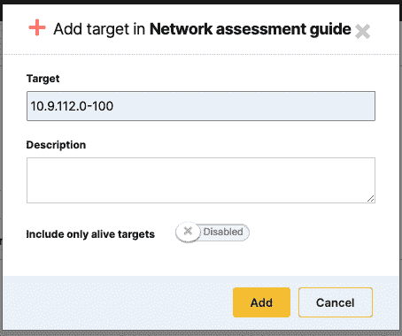添加目标后，使用过滤器选项或**资产**复选框选择范围内的所有 IP。您还可以单独选择特定的 IP，并根据描述、类型、扫描或风险级别对其进行过滤。

然后从扫描工具下拉菜单
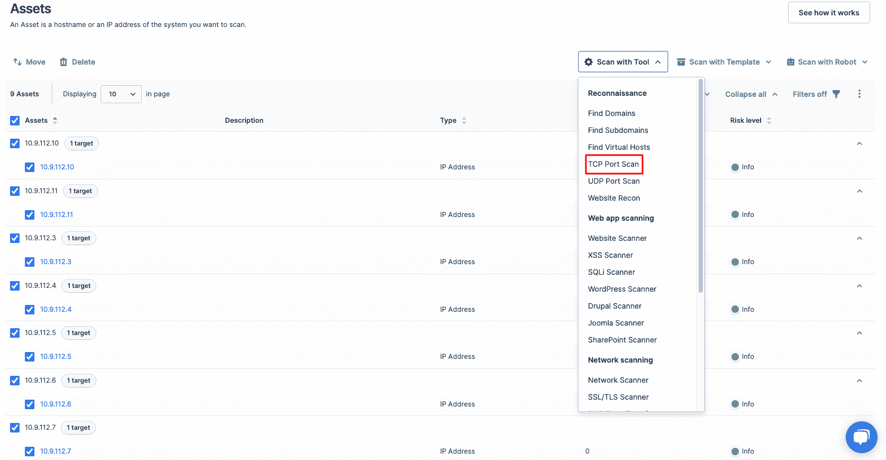中选择 [TCP 端口扫描](https://pentest-tools.com/network-vulnerability-scanning/tcp-port-scanner-online-nmap) 运行扫描

要覆盖所有 65535 端口，选择**范围扫描选项**，从 1 开始到 65535 结束，如下图所示:
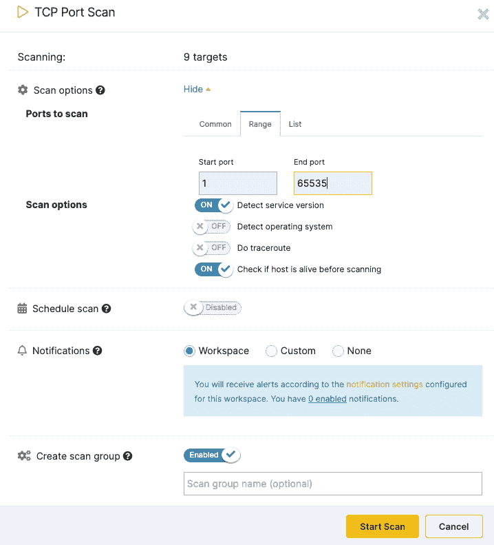

为了可视化结果，转到**扫描**并找到找到多少开放端口的摘要。

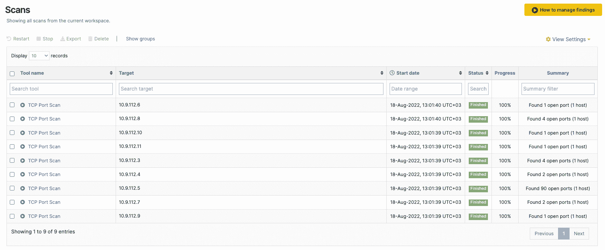要查看集中视图，请查看 [攻击面](https://pentest-tools.com/features/attack-surface) ，在这里您可以看到所有结果都组织在一个表格中。

例如，如果您想查看攻击面中的特定 IP，请通过“IP 地址”字段进行过滤:

以下是带有 Nmap 扫描结果的 TCP 端口扫描器的外观:

从扫描结果页面，您可以选择任何特定的端口，并使用我们的 [20+安全工具](https://pentest-tools.com/alltools) 之一对其进行扫描，以深入评估。

## 2.使用 UDP 端口扫描来查找更多开放的端口

尽管 UDP 服务不如 TCP 服务受欢迎，但易受攻击的 UDP 服务会使目标系统面临与易受攻击的 TCP 服务相同的风险。发现所有开放的 UDP 端口是应对网络漏洞以更好地保护您的网络基础设施的一个重要步骤。

我们的 [**UDP 端口扫描器**](https://pentest-tools.com/network-vulnerability-scanning/udp-port-scanner-online-nmap) 帮助您发现目标主机上哪些 UDP 端口是打开的，识别服务版本，并检测操作系统。

如果您想只包括*活动目标*，在添加它们时选择“只包括活动目标”选项。

**有用提示**:如果你的目标没有响应 ICMP 请求，并且有除默认端口(80、443、445)之外的其他开放端口，它将不会被添加，即使它是开机的。

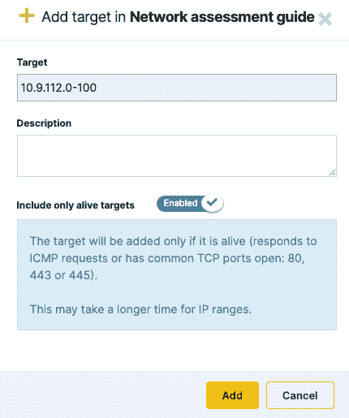要开始 UDP 扫描，选择您的 IP 或主机名，使用工具转到**扫描，并选择 **UDP 端口扫描** :** 

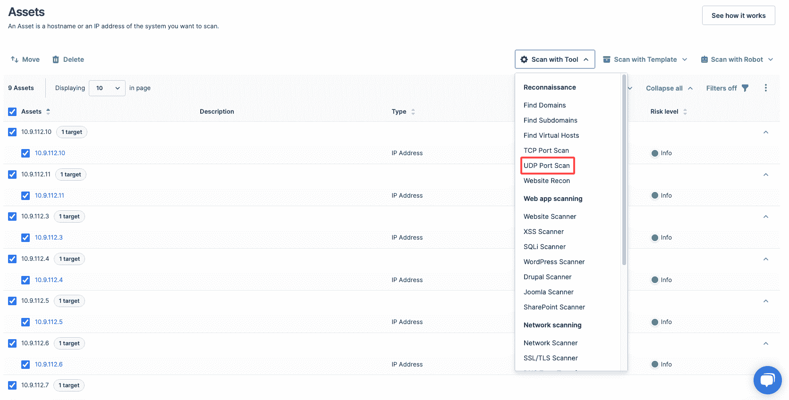要覆盖所有 65535 端口，其工作流程与 TCP 端口扫描器相同。选择范围扫描选项，从 1 到 65535，如下所示。

因为这是覆盖所有端口的彻底扫描，所以可能需要一段时间。为获得更快的扫描速度，选择前 1000 个端口，但请记住可能不会发现前 1000 个中未包含的任何端口*。详情请查看 [默认端口列表](https://support.pentest-tools.com/en/scans-tools/scanner-default-port-list) 。* 

 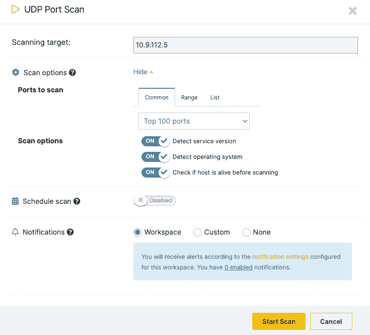要可视化扫描结果，您有两个选项:

*   **攻击面**功能，从所有扫描器中提取数据，并以表格形式(带过滤器)提供所有结果的集中视图

*   **从您的仪表板扫描**选项卡，在那里您可以获得所有打开端口的概览。

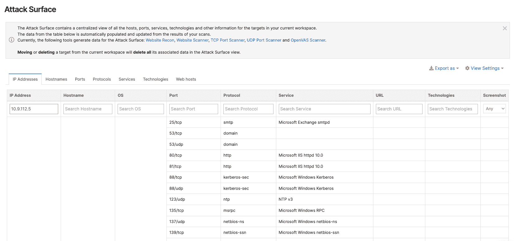

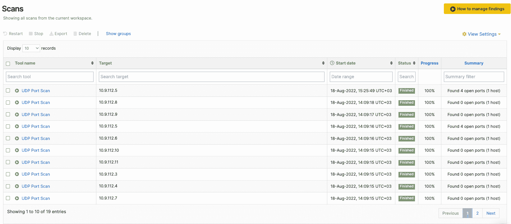下面是带有 Nmap 扫描结果的 UDP 端口扫描器的样子:

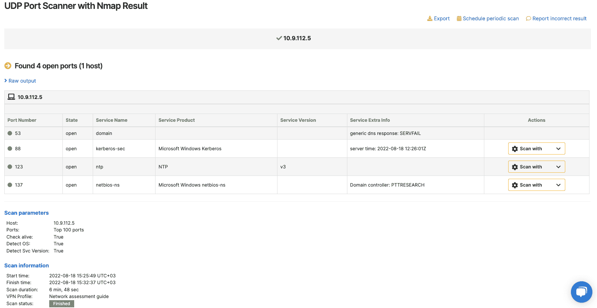

## 3.执行轻型网络漏洞扫描

我们的 [网络漏洞扫描器](https://pentest-tools.com/network-vulnerability-scanning/network-security-scanner-online-openvas) 的轻型版本执行**快速安全评估**，与目标系统的交互最少。

它首先运行 Nmap 来检测开放的端口和服务。然后，根据 Nmap 返回的结果，我们的网络扫描器查询具有已知漏洞的数据库，以检查服务的特定版本是否受到任何问题的影响。

虽然这种检测方法更快，但它容易返回误报，因为它只依赖于服务报告的版本(可能不准确)。如果您选择这种方法，请记住这一点。

从**资产**选项卡中，启动 [**光线扫描**](https://pentest-tools.com/network-vulnerability-scanning/network-security-scanner-online-openvas) 使用**扫描工具** **- >网络扫描仪- >光线扫描:**

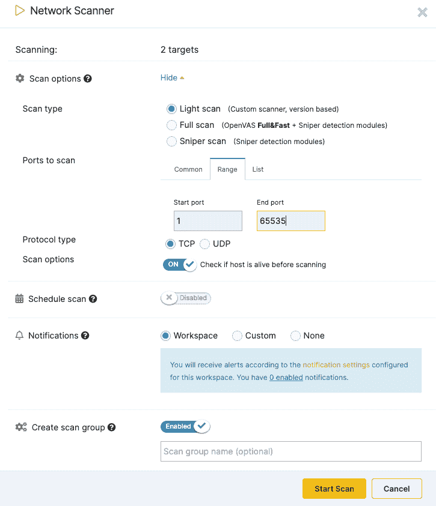要覆盖所有 65535 端口，选择范围扫描选项，从 1 到 65535。

**专业提示**:覆盖所有端口的扫描大约需要 20 分钟，平均 4 个开放端口。

您可以在 [调查结果](https://app.pentest-tools.com/findings) 选项卡中查看结果，并在页面上显示多达 1000 条记录。

## 4.进行全面的网络漏洞扫描

[网络漏洞扫描器](https://pentest-tools.com/network-vulnerability-scanning/network-security-scanner-online-openvas) 的**完整版**将流行的 [OpenVAS](https://www.openvas.org/) 与狙击手自动攻击者检测模块相结合，这些模块是由我们的安全研究团队内部开发的定制漏洞检查。

[狙击手检测模块](https://pentest-tools.com/exploit-helpers/sniper) 通过向目标系统发送精心编制的数据触发异常行为，自动检测高配置软件中最关键的漏洞。

带有狙击手检测模块的网络扫描器提供了一份全面的报告，其中包含丰富的发现，您可以在网络评估中使用。

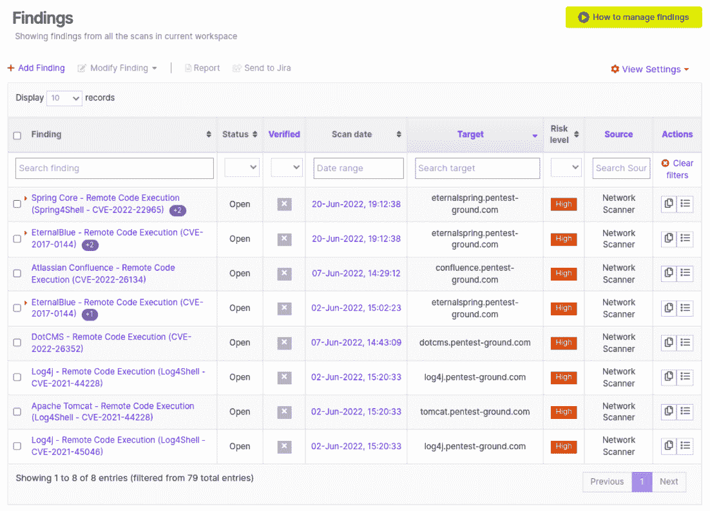最初由 OpenVAS 构建，但现在采用了专有技术，我们的 [网络漏洞扫描器](https://pentest-tools.com/network-vulnerability-scanning/network-security-scanner-online-openvas) 使用自定义漏洞扫描功能运行深度扫描，以评估网络边界。

它是一个多功能的工具，可以帮助您检测网络服务、操作系统和 web 服务器中的各种漏洞。网络扫描仪也是我们在 2021 年最常用的工具，世界各地的网络安全专家都将其应用于网络评估。

您可以发现的漏洞类型包括:

*   Apache Tomcat RCE 漏洞

*   PHP 堆栈 [缓冲区溢出漏洞](https://pentest-tools.com/blog/windows-bad-neighbor-vulnerability-cve-2020-16898)

*   PHP 拒绝服务漏洞

*   [Apache Tomcat](https://pentest-tools.com/blog/exploiting-ognl-injection-in-apache-struts)Windows Installer 权限提升漏洞

*   操作系统生命周期结束

*   米克罗蒂克·罗泰罗斯·RCE 的弱点

*   美国网件设备公司 RCE 漏洞

*   目录遍历漏洞

*   本地文件包含

*   缺少各种补丁的操作系统发行版

*   过时的图书馆

*   过时的 web 服务器

*   SSL/TLS 弱点

*   [远程代码执行](https://pentest-tools.com/blog/wordpress-remote-code-execution-exploit-cve-2019-8942)

*   不同服务的默认凭据

*   过多的简历，以及更多。

如果您在内部网络中也有私人服务器(例如，用于测试环境)，请查看我们的 VPN 代理，它会在我们的扫描机器和您的网络之间创建一个安全隧道。这样，我们的扫描器通过 VPN 隧道从您的内部网络到达主机。了解如何使用 VPN 代理 扫描您的内部网络。

当您准备好开始工作时，进入**资产**选项卡，使用**扫描工具** **- >网络扫描仪- >全扫描**启动 [网络扫描仪](https://pentest-tools.com/network-vulnerability-scanning/network-security-scanner-online-openvas) :

你现在已经知道了这个练习:要覆盖所有 65535 个端口，选择范围扫描选项，从 1 到 65535。

**注**:如果您想要扫描所有端口，并且主机有多个端口打开，请注意扫描可能需要一段时间。扫描完成后，转到**扫描**选项卡查看结果。

查看扫描结果的另一种方法是从您的仪表板中查看**结果**选项卡，每页显示多达 1000 条记录。 

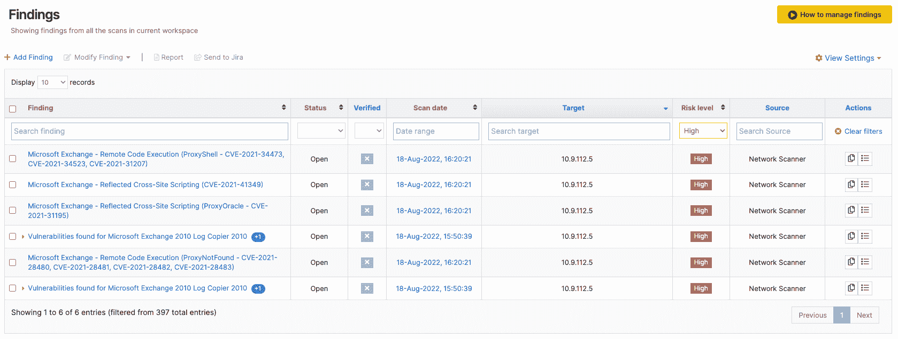

## 5.[可选]利用狙击手攻击脆弱目标

如果 [网络漏洞扫描器](https://pentest-tools.com/network-vulnerability-scanning/network-security-scanner-online-openvas) 检测到具有狙击手自动利用程序模块的高风险 CVE，您可以使用扫描部分中的“**利用狙击手**”按钮开始重点扫描。

这样，如果目标系统易受攻击，您可以验证*。狙击手利用这个漏洞，从系统中提取 [假象](https://pentest-tools.com/exploit-helpers/sniper#artefacts) 。
T13*

## 6.使用 SSL/TLS 扫描器查明薄弱配置和常见漏洞

对于不在 Azure 或 AWS 等主流平台上托管的应用，也可以使用 [SSL/TLS 扫描器](https://pentest-tools.com/network-vulnerability-scanning/ssl-tls-scanner) 。它对目标的 SSL/TLS 服务的配置执行安全评估，并提供弱点和问题列表以及详细的补救建议。

从**目标**选项卡，使用**扫描工具- > SSL/TLS 扫描仪** :
启动 [SSL/TLS 扫描仪](https://pentest-tools.com/network-vulnerability-scanning/ssl-tls-scanner)

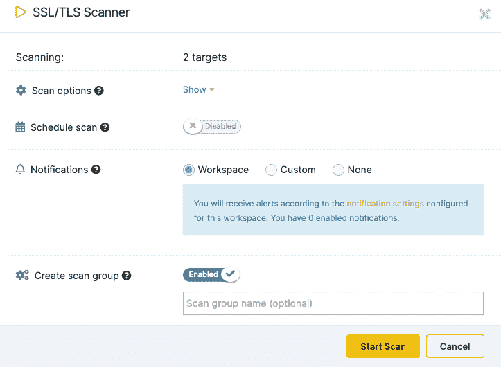  **专业提示**:您可以创建一个**扫描模板，自动运行本指南中提到的大多数扫描仪**。在 Pentest-Tools.com 上，扫描模板允许您链接多个工具和平台功能，以便一次启动它们。

扫描模板和我们的之间的主要区别🤖[pentest 机器人 ？模板运行所有扫描，即使有些扫描不适用于目标。然而，pentest 机器人编排多个工具，并按照您在特定过滤器中实现的逻辑顺序运行它们。](https://pentest-tools.com/features/pentest-robots)

## 7.使用密码审计器查找弱凭据

对于需要认证的应用程序，通过尝试输入 [单词列表](https://app.pentest-tools.com/wordlists) 中的用户名和密码来检查您是否使用了弱凭证。

您的[Pentest-Tools.com](https://pentest-tools.com)账户中的单词列表首先提供了一个预定义的凭证列表，但是您也可以创建、更新和管理您的用户名/密码组合列表，以便更快地检测出脆弱的组合*。*

*[密码审计器](https://pentest-tools.com/network-vulnerability-scanning/password-auditor) 的独特优势之一是**自动检测 web 应用程序**中的 web 表单，并尝试使用给定的凭证自行登录。它**检测 web 表单认证是否成功**，通过消除手动检查使您的工作流程更加顺畅。*

*因此，您可以很容易地找到带有弱密码的 web 接口(例如 Jenkins、Tomcat、PhpMyAdmin、Cisco 路由器等。)配合 SSH、FTP、MySQL、MSSQL、RDP 等网络服务。，有时也有默认凭据。*

***亲提示**:🤖您也可以使用**Auto HTTP log in brute forcer pentest robot**来执行整个测试流程。该机器人试图发现受密码保护的 URL(使用 HTTP 基本身份验证-代码 401 ),并试图使用一系列常用用户名和密码进行自动暴力攻击。该测试针对目标主机的所有 HTTP/S 端口执行。*

*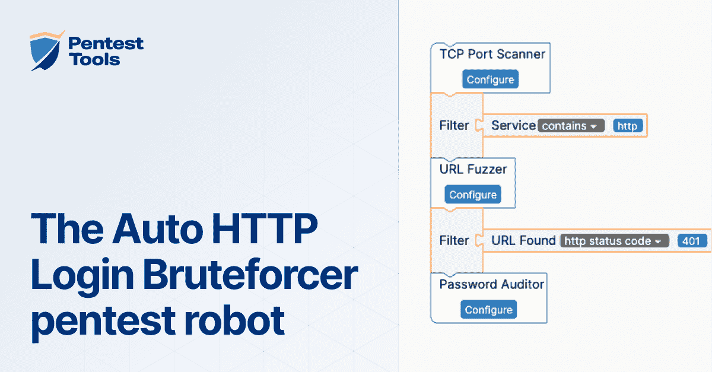要查找弱凭据，请从“资产”选项卡的**扫描工具**下拉菜单中启动密码审计器:*

*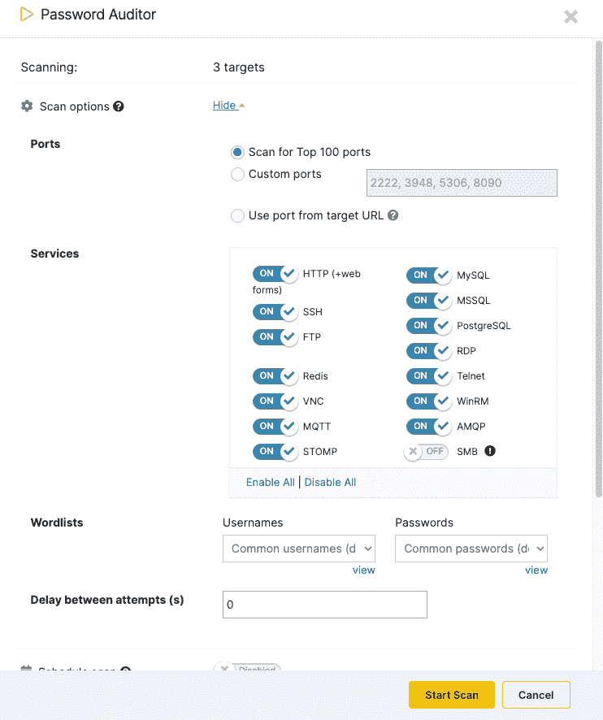 如果密码审计员发现一组脆弱的凭证，你可以用**狙击手认证扫描**来验证它们。*

*目前，该工具支持 SSH、WinRM 和 SMB 协议，但我们计划添加更多。Sniper 使用给定的凭证进行验证，从系统中提取所有工件，并在输出报告中显示它们。* 

* *

## *8.验证调查结果并根据您的帐户生成报告*

*使用我们的**漏洞管理功能**(在仪表板的**调查结果**下)来:*

*   *验证每个发现*

*   *改变其风险级别(如果适用)*

*   *将其标记为已修复或已忽略*

*   *通过从多个扫描仪中选择结果生成 [高级报告](https://pentest-tools.com/usage/pentest-reporting-tool) 。从我们的 [专用支持指南](https://support.pentest-tools.com/en/vulnerability-management-and-reporting#reporting) 中了解如何创建和生成网络评估报告。*

***重要提示:**为了确保扫描器正常运行，将以下 FQDN 列入白名单:【scanners.pentest-tools.com】的**。该主机名解析为我们的扫描服务器使用的多个 IP 地址。点击 查看 [完整的 IP 地址列表。](https://support.pentest-tools.com/en/getting-started/source-ip-addresses)***

***每个网络漏洞评估都有一些独特之处，让每个有道德的黑客为他们发现的漏洞以及他们如何利用漏洞而自豪。这是其中一个故事和我们得到的结果。***

***在一项涉及网络评估的任务中，我们的团队使用了 [网络漏洞扫描器](https://pentest-tools.com/network-vulnerability-scanning/network-security-scanner-online-openvas) 。***

***在主机上，我们发现服务器上运行着一个 Oracle Glassfish 实例。在网络扫描器完成之后，一个关于 META-INF 参数的**目录遍历漏洞**是一个有趣的发现。*** 

***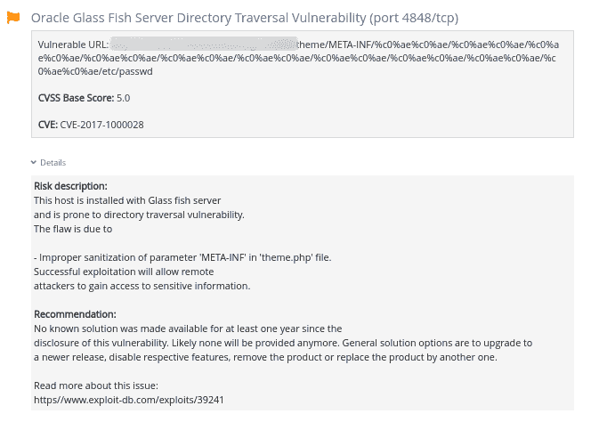我们还发现一个 Apache Tomcat 实例**运行在同一服务器的非默认端口**上。***

***在将这个漏洞与目录遍历漏洞联系起来之后，我和我的同事**检索了 tomcat-users.xml 文件**，其中包含用于登录 Apache Tomcat 的 manager 部分的用户名和密码。使用找到的用户名和密码登录，我们的 pentest 团队上传了一个特制的 WAR 文件，因为 Tomcat 使用 servlets 来部署 web 应用程序。我们还使用 msfvenom 创建了一个**反向 shell，一旦我们访问了部署的 WAR 文件，我们就建立了一个反向 shell。导致**远程代码执行**。*****

*** 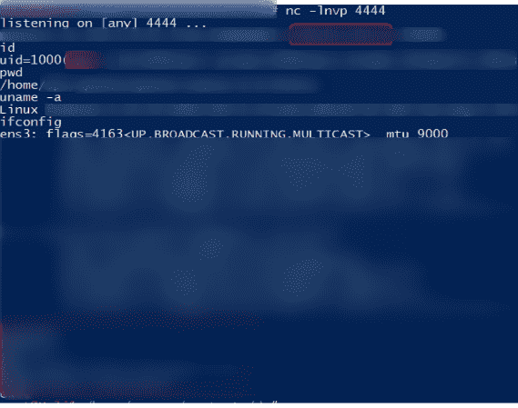我们从此次项目中学到的一个重要经验是，处理不断增加的漏洞可能会带来意想不到的发现。***

***我鼓励你*永远*提倡持续扫描系统和网络的漏洞。***

***这就是为什么在 Pentest-Tools.com 的[T5，我们的团队不断致力于](https://pentest-tools.com) [用新的扫描仪更新平台](https://pentest-tools.com/change-log) 并改进现有的**以使您的工作更容易**。***

***有了这份实用指南和您在我们平台上选择的工具，您可以进行全面的网络漏洞评估，从而节省您花费在手工工作上的时间。***

***我希望你发现这一步一步的帮助，因为我会带着更多回来！***

******附:你知道吗？******

***除了各种工具和功能，Pentest-Tools.com 还为 web 应用程序和 IT 基础设施提供 [**托管测试服务**](https://pentest-tools.com/services/web-application-penetration-testing) 。我们的认证安全专业人员团队处理我刚才描述的整个过程以及更多内容。如果你想和我们一起工作，我们很乐意帮忙！***