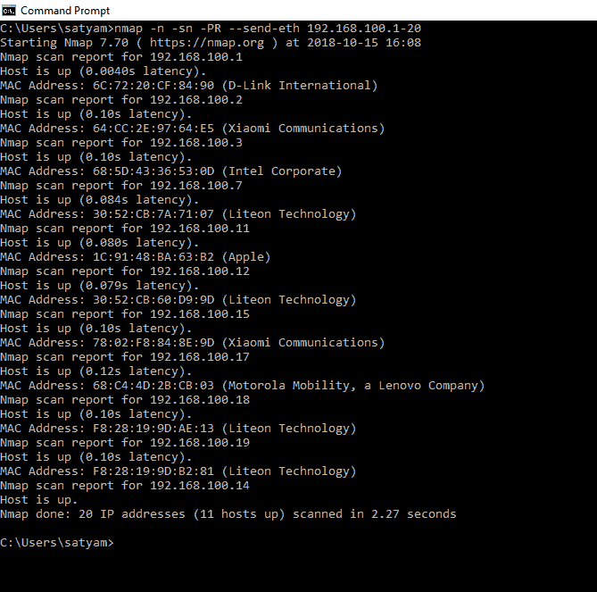
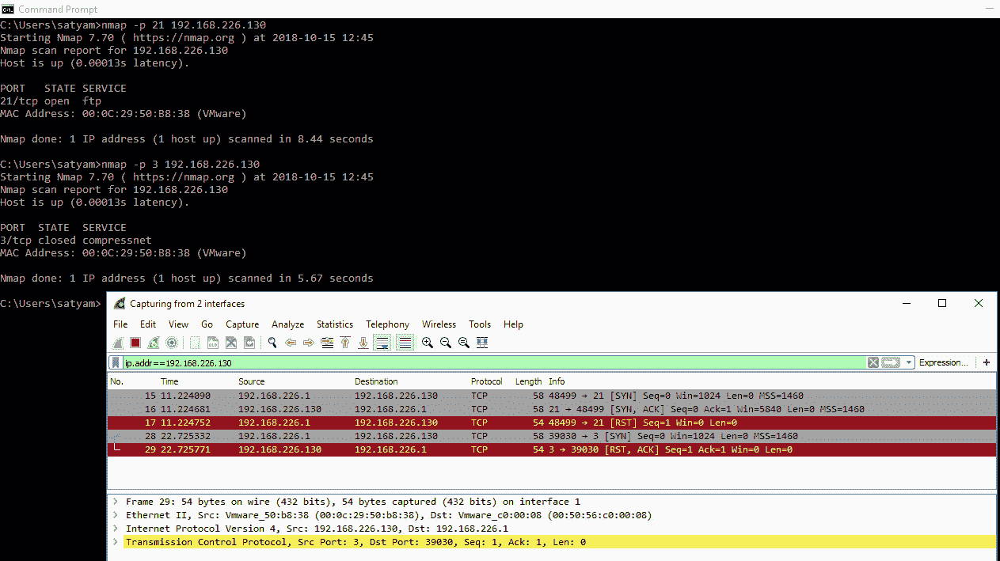
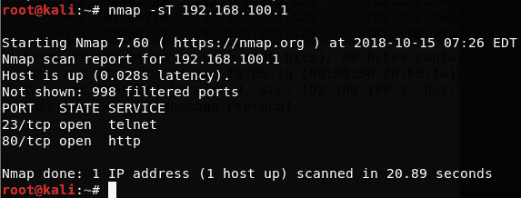
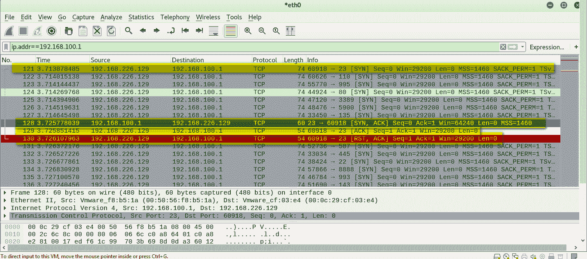
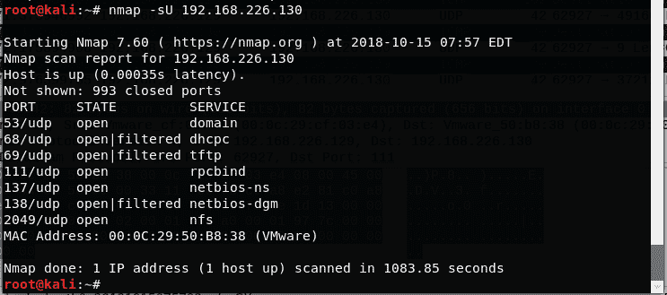
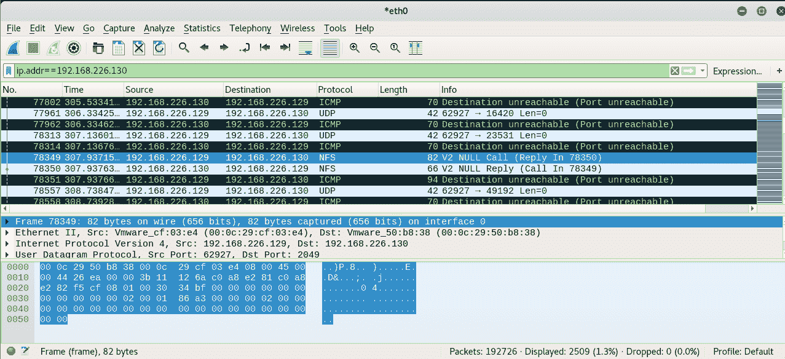
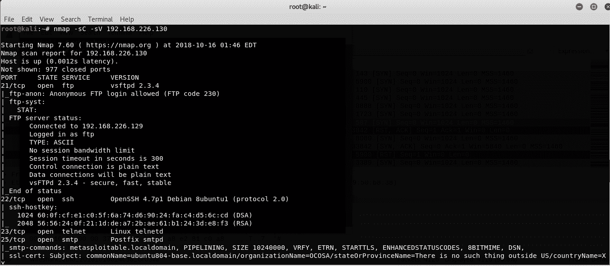
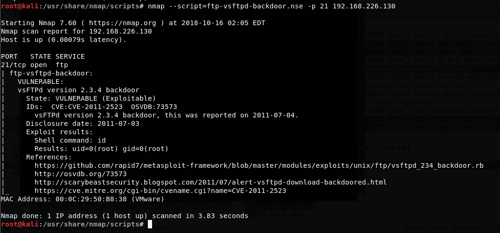

# 世界上最著名的港口扫描仪| Pentest-Tools.com

> 原文：<https://pentest-tools.com/blog/nmap-port-scanner#2022-07-07T12:34:28.000Z>

本文深入探讨了 Nmap 的工作原理，理解了它的内部结构，掌握了它的功能。

网络管理员和渗透测试人员使用端口扫描来发现计算机系统上开放的通信信道。对于攻击者来说，这是获取目标网络信息并识别潜在进入途径的第一步，因为在开放端口上运行的服务可能容易受到攻击。

多种工具可以产生好的结果，但是有些[端口扫描器](https://pentest-tools.com/network-vulnerability-scanning/tcp-port-scanner-online-nmap)比其他的更适合特定的任务。我们的重点是 [**【网络映射器】**](https://nmap.org/) ，这是目前最流行的网络发现和端口扫描工具。它的一些功能包括主机发现、端口扫描、服务和操作系统指纹识别以及基本的漏洞检测。还有一个名为 [**Zenmap**](https://nmap.org/zenmap/) 的图形版本，可以轻松访问扫描选项和网络映射图。

在本文中，我们将描述 Nmap 如何帮助您:

1.  [**发现网络上的活主机**](#1-nmap-host-discovery)

2.  [**扫描开放端口**](#2-scan-for-open-ports)

3.  [**发现服务**](#3-discover-services)

4.  [**漏洞测试**](#4-test-for-vulnerabilities)

**端口扫描替代方案**

Nmap 不是唯一可用的端口扫描器，这一类别中的其他工具也适合特定需求。一些比较受欢迎的是:

*   [**Unicornscan**](https://tools.kali.org/information-gathering/unicornscan) 对于收集网络和操作系统信息很有用，它还附带了异步 [TCP 和 UDP 扫描](https://pentest-tools.com/network-vulnerability-scanning/udp-port-scanner-online-nmap)、端口扫描以及服务和操作系统指纹识别等功能。

*   [**愤怒的 IP 扫描器**](https://angryip.org/) 是一个基于 GUI 的高速扫描工具，允许用户运行 ping 扫描网络。根据检测到的实时 IP，它可以扫描端口和服务，揭示 MAC 地址，以及解析主机名。

*   [**Masscan**](https://github.com/robertdavidgraham/masscan) 被广泛认为是最快的港口扫描仪。它既有命令行又有图形界面，默认传输速率为每秒 100 包。

*   [**Onetwopunch**](https://github.com/superkojiman/onetwopunch) 是一个强大的脚本，它结合了 unicornscan 和 Nmap 工具的功能，可以获得更快、更准确的结果。它使用 unicornscan 扫描所有 65535 端口，然后将结果反馈给 Nmap 进行服务指纹识别。通过这种方式，用户可以获得一个完整的开放端口列表以及在这些端口上运行的服务。

## **1。Nmap 主机发现**

默认情况下，Nmap 使用请求来识别活动 IP。在该工具的旧版本中，ping 扫描的选项是-sP；在较新的版本中，它是-sn。为了发现可用的主机，会发送以下数据包(如下面 Wireshark packet analyzer 的屏幕截图所示):

*   ICMP 回应请求

*   发往端口 443 的 TCP SYN 数据包

*   发往端口 80 的 TCP ACK 数据包

*   ICMP 时间戳请求

如果目标未知且较大，建议首先识别主机。在此阶段扫描端口会产生过多的流量，耗费时间和资源，并且可能会触发安全警报。

以下是识别活 IP 的一些方法:

**ARP 扫描**可以用来悄悄发现本地局域网中的主机。得到一个 ARP 回复意味着主机存在，因为这个 ARP 是路由信息包所需要的，所以防火墙不会干涉交换。

`nmap -n -sn -PR --send-eth 192.168.100.1-20`

上面，您可以看到 Wireshark 捕获的一个 ARP 请求和回复。

**ICMP 扫描**还可以通过发送 ICMP 回应请求来识别活动主机。活主机会发回一个应答，表示它在网络上。

`nmap -sP -PE 192.168.100.1/24`

使用-PP 选项，Nmap 将发送 ICMP 时间戳请求(类型 13)，并期待 ICMP 时间戳回复(类型 14)。如果收到类型 14 ICMP 数据包，Nmap 会认为主机是活动的。

`nmap -sP -PP 172.26.1.4`

-PM 选项发送 ICMP 地址掩码(网络掩码)请求(类型 17)，期望得到 ICMP 地址掩码回复(类型 18)。同样，如果收到类型 18 的数据包，则主机是活动的。

`nmap -sP -PM 172.26.1.4`

请记住，ICMP 消息可能会被某些防火墙阻止，因此这种技术可能并不总是有效。

[**TCP 扫描**](https://pentest-tools.com/network-vulnerability-scanning/tcp-port-scanner-online-nmap) 代表发现主机的另一种方式，使用命令发出 TCP SYN 或 TCP ACK ping 消息:

通过 TCP SYN 扫描，Nmap 向目标上的给定端口发送 SYN 数据包。如果机器回复指定端口的 SYN/ACK 或 RST 数据包，Nmap 知道主机已启动。在一段时间内没有响应会导致主机被标记为停机。

`nmap -sP -PS 21 IP`

在 [TCP ACK](https://pentest-tools.com/network-vulnerability-scanning/tcp-port-scanner-online-nmap) 扫描期间，Nmap 发送一个空的 TCP 数据包，其 ACK 标志设置为端口 80。如果主机启动，它将使用 RST 数据包进行应答，因为连接不存在。如果主机关闭，将不会有响应。端口可以由用户定义。

`nmap -sP -PA IP`

如果活动 IP 地址列表已经存在，则没有必要进行主机发现，您可以进入下一步，查找开放端口。

`nmap -Pn IP`

## **2。扫描开放端口**

Nmap 根据收到的 SYN 请求响应来识别端口状态。

*   **打开端口** : Nmap 接收“syn-ack”作为探测响应

*   **关闭端口** : Nmap 收到“RST”作为探测响应

*   **Filtered** : Nmap 在没有收到任何响应时将端口标记为 open | filtered，这可能是由于防火墙过滤造成的

有多种技术可用于端口扫描:

**隐身扫描**，也称为 SYN 扫描或半开扫描，是默认且最流行的技术。它的隐蔽性来自于不执行 3 次握手来完成连接，数据包交换如下:

1.  扫描仪发送一个 SYN 数据包。

2.  如果端口打开，机器用 SYN/ACK 回复；

3.  如果端口关闭，机器发送 RST；

4.  如果多次重试后仍未收到响应，该端口将被标记为已过滤。

5.  一旦扫描器从机器接收到 SYN/ACK，它就发送 RST 数据包并将其标记为开放端口。

`nmap -sT IP`

下图显示了 Wireshark 捕获的扫描过程中的数据包交换:

*   数据包 526 将 SYN 数据包从源 IP 发送到 TCP 端口 135 上的 192.168.100.19

*   数据包 545 在 TCP 端口 135 上从 IP 192.168.100.19 发送一个 SYN-ACK 数据包

*   数据包 546 从源 IP 向 TCP 端口 135 上的 192.168.100.19 发送 RST 数据包，以关闭连接。端口 445 和端口 80 也是如此

**TCP 连接**扫描完成了与目标机器的三次握手，是秘密扫描的一个很好的替代方案。流程如下:

*   扫描仪发送一个 SYN 数据包。

*   如果端口打开，机器会发送 SYN/ACK；

*   如果港口关闭，机器将发送 RST；

*   如果多次重试后仍未收到响应，该端口将被标记为已过滤。

*   一旦扫描器接收到 SYN/ACK，它就发送 ACK 包来完成连接。

`nmap -sT IP`

为了更好地了解信息包交换过程，我们捕获了流量，以便一窥幕后的情况。您可以看到，连接从一个可见的 SYN 包 inline 121 开始，当发送 ACK 包时，握手完成。

与 SYN 扫描不同，TCP 连接的结果很慢，连接的完成可能会创建一个日志条目，从而暴露入侵企图；当源 IP 被防火墙、IDS 或 IPS 安全设备列入白名单时，它就会工作。

[**UDP 扫描**](https://pentest-tools.com/network-vulnerability-scanning/udp-port-scanner-online-nmap) 比 TCP 端口扫描慢，正因为如此，常常被安全审计员忽略。

Nmap 通过向端口发送 UDP 数据包来运行检查。对于大多数端口，数据包是空的，对于公共端口，数据包包含与协议相关的有效载荷。

得到“ICMP 端口不可达错误(类型 3，代码 3)”消息意味着端口被关闭，没有响应意味着端口被打开或被过滤，这使得它缓慢和不准确；如果响应包含任何数据，这意味着端口是开放的。

`nmap -sU IP`

在下面捕获的通信量中，数据包 78349 和 78350 包含对端口 2049 上执行的探测的 UDP 响应。对于许多关闭的端口，响应显示为“端口不可达”

## **3。发现服务**

Nmap 可以通过监听打开的通信端口来识别服务。许多常见服务(SSH、Telnet、FTP、SMTP)以这种方式标识自己。

如果未公布横幅，Nmap 会发送一个探测并等待回复。使用服务扫描(-sV)命令接收的数据会与 Nmap 保存在其数据库文件中的数千个签名进行比较，这些签名专门用于服务指纹识别目的。

`nmap -sV IP`

## **4。漏洞测试**

Nmap 可以通过 Nmap 脚本引擎(NSE)发现网络中的漏洞，这是一种通过-sC 选项激活的灵活功能，允许用户为任务自动化编写脚本。

NSE 附带了丰富的脚本集合，可以帮助网络发现过程，包括[漏洞利用](https://pentest-tools.com/exploit-helpers/sniper)和后门检测。该数据库在 Linux 上的“/usr/share/nmap/scripts/”中可用，在 Windows 上的“C:\ Program Files(x86)\ Nmap \ scripts”中可用。

`nmap -sC IP`

通过–script 命令可以测试远程目标上的特定漏洞:

`nmap --script=<nse script> -p <port> IP`

您可以使用此命令检查 FTP 服务器上的匿名登录权限:

`nmap --script= ftp-anon.nse -p 21 192.168.226.130`

NSE 脚本的缓存提供了检查已经报告的特定漏洞的可能性。例如，有一个脚本检查 VSFTPD 服务器中的后门:

`nmap --script= ftp-anon.nse -p 21 192.168.226.130`

**了解如何使用 Nmap 发现开放的通信通道**

Nmap 是渗透测试人员和网络管理员的强大工具。每个新版本都扩展了它的功能，远远超出了项目开始时的简单端口扫描器。它是一个成熟的工具，还可以识别关键的漏洞，并执行一些 web 应用程序级别的测试。

有关所有命令和功能的详细信息，请参见 [Nmap 官方网站](https://nmap.org/)。