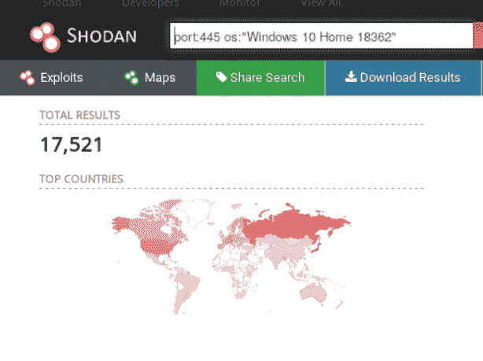
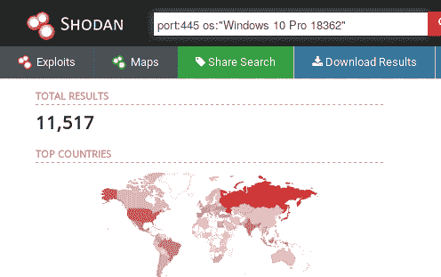
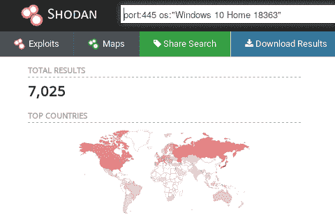
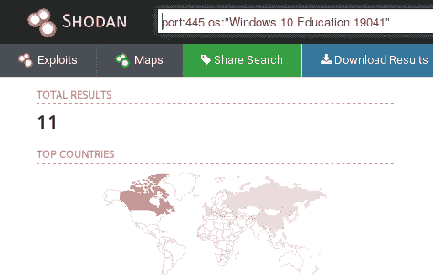

# 如何在 Windows 10 中连锁 SMBleed 和 SMBGhost 获得 RCE | Pentest-Tools.com

> 原文：<https://pentest-tools.com/blog/smbleedingghost-exploit#2023-02-21T16:18:49.000Z>

像进攻者一样思考，像防守者一样行动。

如果你问我，那是圣灵降临派的口头禅。

这就是为什么今天我们要深入探讨恶意行为者使用的最有趣的策略之一:**漏洞链**。

为了使这既实用又与当前环境相关，我们将探索服务器消息块(SMB)协议中影响多个版本的 Windows 10 和 Windows Server 产品的一个关键漏洞。

该漏洞使得攻击者能够转储目标的未初始化内核内存。通过将 SMBleed (CVE-2020-1206)漏洞与 SMBGhost (CVE-2019-0796)链接，实现远程代码执行要容易得多。

## **1。漏洞概述**

### **什么是 SMBleed？**

您可以将 SMBleed ( [CVE-2020-1206](https://cve.mitre.org/cgi-bin/cvename.cgi?name=CVE-2020-1206) )视为 SMBGhost 的小妹妹，因为他们有着相同的根本原因 SMB 协议处理客户端提供的数据解压缩的方式。

具体来说，该漏洞发生在 *srv2.sys* SMB 驱动程序中的*SRV 2 decompression data*函数中。这个功能也是[发现 SMBGhost](https://pentest-tools.com/blog/how-to-detect-microsoft-smbghost-vulnerability) 的原因。

除了压缩数据，客户端还可以设置*OriginalCompressedSegmentSize*头，它负责指示必须为解压缩过程分配的空间。如果您发送的值超过了所需的大小(但不是太多！)对于解压缩的数据，它将被未初始化的内核内存数据填充。

**下面是易受攻击的源代码:**

```
NTSTATUS Srv2DecompressData(PCOMPRESSION_TRANSFORM_HEADER Header, SIZE_T TotalSize) {
    PALLOCATION_HEADER Alloc = SrvNetAllocateBuffer((ULONG)(Header->OriginalCompressedSegmentSize + Header->Offset), NULL);
    If (!Alloc) {
       return STATUS_INSUFFICIENT_RESOURCES;     
    }    
    ULONG FinalCompressedSize = 0;  
    NTSTATUS Status = SmbCompressionDecompress(Header->CompressionAlgorithm, (PUCHAR)Header + sizeof(COMPRESSION_TRANSFORM_HEADER) + Header->Offset, (ULONG)(TotalSize - sizeof(COMPRESSION_TRANSFORM_HEADER) - Header->Offset), (PUCHAR)Alloc->Ueader->OriginalCompressedSegmentSize, &FinalCompressedSize);
    if (Header->Offset > 0) {
        memcpy(Aeader->Offset);
    }
    Srv2ReplaceReceiveBuffer(some_session_handle, Alloc);
    return STATUS_SUCCESS;
}
```

SMBGhost 基于相同的技术，但是您必须发送一个大的*OriginalCompressedSegmentSize*头值来触发缓冲区溢出，这使得攻击者能够在缓冲区边界之外执行代码。

### **有哪些“出血”版本？**

您可以利用 Windows 10 和 Windows Server 版本 1903、1909 和 2004 中的 SMBleed 漏洞。

受影响的版本包括从 OS Build 18362.720 (KB4551762)开始的 1903 和 1909，分别为 18363.720 (KB4551762)及以下。但是，KB4551762 之前的版本(不包括它)也容易受到 SMBGhost 的攻击，因此可能存在连锁利用。

除此之外，你还可以通过 SMBleed 漏洞滥用 OS Build 19041.329 (KB4557957)之前的 2004 版，排除它。

### **如何找到受 SMBleed 影响的系统**

要使目标易受攻击，它必须运行 SMBv3.1.1 协议并启用压缩功能，默认情况下**打开**。如今，大多数 Windows 机器的 SMB 服务不太可能暴露在互联网上，因此您通常会在内部网络中发现此漏洞，最有可能被滥用来执行横向移动。

让我们来看看 [Shodan](https://www.shodan.io/) 可能受影响的设备，这些设备具有暴露于互联网的 SMB 协议，也运行我们刚刚提到的易受攻击的操作系统版本。

我们在运行一些示例查询后收集了结果。如您所见，大量设备很可能容易受到 SMBleed 的攻击。

 *(可能有 17，521 台受影响的 Windows 10 家庭设备–版本 1903)*

 *(可能有 11，517 台受影响的 Windows 10 Pro 设备–版本 1903)*



*(可能有 7，025 台受影响的 Windows 10 家庭设备–版本 1909)*

*(11 种可能受影响的 Windows 10 教育设备–2004 版)*

选择适当的目标或决定检查您自己的主机后，您可以使用我们的 [SMBGhost 漏洞扫描器](https://pentest-tools.com/network-vulnerability-scanning/network-security-scanner-online-openvas)启动扫描。**如果系统受到 SMBGhost 的影响，它也会自动受到 SMBleed 的攻击！**

## **2。漏洞利用概述**

### **用 SMBleed 弹出内核内存**

这个问题是由 ZecOps 研究团队发现的，他们还发布了一个公开的 T2 概念验证。您可以使用 PoC 利用 SMB 服务，通过巧尽心思构建的 WRITE 消息获取泄漏到输出文件的 Windows 未初始化内核内存。但是，它需要有效的身份验证和对目标计算机上网络共享的访问权限。

<template x-if="showVideo"></template>

### **用 sm bleed+SMBGhost(SMBleedingGhost)打 RCE**

还有另一个开源漏洞，它结合了 SMBleed 和 SMBGhost 漏洞来**实现未经认证的远程代码执行**，最初命名为 [SMBleedingGhost](https://github.com/ZecOps/CVE-2020-0796-RCE-POC/blob/master/SMBleedingGhost.py) 。

<template x-if="showVideo"></template>

**提示:**在开始运行 SMBleedingGhost 漏洞利用之前，您需要找到目标的偏移量，这对于每个版本都是相同的。

例如，如果您有两台 Windows 10 家用计算机，其操作系统版本为 18363.720(版本 1909)，它们将共享相同的偏移量。这意味着在实现远程代码执行之前，您必须玩一个小小的“猜测”游戏。

要查找特定 Windows 版本的偏移量，请在正在运行的实例上运行[该脚本](https://github.com/ZecOps/CVE-2020-0796-RCE-POC/blob/master/calc_target_offsets.bat)。之后，您必须通过修改代码开头的“OFFSETS”数组定义的值来编辑 [SMBleedingGhost](https://github.com/ZecOps/CVE-2020-0796-RCE-POC/blob/master/SMBleedingGhost.py) 漏洞。方法如下:

```
OFFSETS = {
    ‘srvnet!SrvNetWskConnDispatch’: value,
    ‘srvnet!imp_IoSizeofWorkItem’: value,
    ‘srvnet!imp_RtlCopyUnicodeString’: value,
    ‘nt!IoSizeofWorkItem’: value,
    ‘nt!MiGetPteAddress’: value
}
```

其中*值*是以下格式的十六进制地址:0x*****

为了让您的工作更轻松，我们为 Windows 10(1909 版)各种操作系统版本确定了一些偏移量:

| **Windows 10(1909 版)内部版本** | **v10.0.18363.418** | **第十节。0 .18363 .535–v 10。0 .18363 .628** | 10.0.18363.693 | 10.0.18363.752 |
| --- | --- | --- | --- | --- |
| SrvNetWskConnDispatch | 0x2D170 | 0x2D170 | 0x2D170 | 0x2D170 |
| imp_IoSizeofWorkItem | 0x32210 | 0x32210 | 0x32210 | 0x32210 |
| S7-1200 可编程控制器 | 0x32288 | 0x32288 | 0x32288 | 0x32288 |
| IoSizeofWorkItem | 0x12C380 | 0x12C400 | 0x6D7A0 | 0x12C410 |
| MiGetPteAddress | 0xBADC8 | 0xBA9F8 | 0xF1D28 | 0xBA968 |

注意唯一改变的偏移是`IoSizeofWorkItem` 和`MiGetPteAddress` *。*所以，如果你想瞄准一个 Windows 10 版本 1909，你就得和那两个“玩”了。

您也可以很容易地强行使用这些值，因此每个偏移量有 165 或 166 >种可能性。

## **3。如何修复这些臭名昭著的 SMB 漏洞:SMBleed 和 SMBGhost**

最有效和推荐的解决方案是应用微软官方补丁。对于 1903 和 1909 版本，使用 [KB4560960](https://support.microsoft.com/en-us/help/4560960/windows-10-update-kb4560960) 或更高版本进行更新；对于 2004 版本，使用 [KB4557957](https://support.microsoft.com/en-us/help/4557957/windows-10-update-kb4557957) 或更高版本进行更新。

对于那些由于客观原因无法更新机器的用户，还有其他的解决方法**。**

**最快的方法是**禁用 SMBv3 服务器压缩功能**，您可以打开 PowerShell 并输入以下命令:**

```
`Set-ItemProperty -Path 
"HKLM:\SYSTEM\CurrentControlSet\Services\LanmanServer\Parameters" 
DisableCompression -Type DWORD -Value 1 -Force`
```

**这不会有任何负面影响，您甚至不必重新启动主机。它只会防止针对 SMB 服务器的攻击，使您的 SMB 客户端仍然易受攻击。**

**您可以应用的另一个解决方案是**将 SMB 服务**——默认情况下在端口 445 上运行——限制在需要访问它的机器上。你可以通过防火墙使用**白名单方法来做到这一点，防火墙**将丢弃任何试图进入该端口的数据包，除了来自允许的机器的数据包。**

## ****4。为什么修复 SMBleed 和 SMBGhost 很重要****

**漏洞越臭名昭著和无处不在，它对攻击者的吸引力就越大。**

**这意味着 pentesters 和其他像您一样的安全专家必须发挥创造力，不仅要找到这些漏洞，还要预测恶意行为者可能会如何利用它们。**

**漏洞链使他们能够以最便捷的方式获得访问权限，然后深入网络。**

**这就是为什么在他们有机会测试你的反应之前，你必须在他们之前侦察并修补你暴露的端点。**