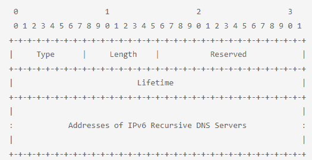

# 发现“坏邻居”有多危险- TCP/IP 漏洞(CVE-2020-16898)| Pentest-Tools.com

> 原文：<https://pentest-tools.com/blog/windows-bad-neighbor-vulnerability-cve-2020-16898#2022-07-09T02:54:12.000Z>

修补从来都不容易，但是做得不完美会反过来伤害你。这就是为什么我们今天要揭露一个漏洞，如果缓解不当，该漏洞可能会再次出现。

微软最近在 10 月份发布了一个针对 IPv6 堆栈中令人讨厌的 [CVE-2020-16898](https://nvd.nist.gov/vuln/detail/CVE-2020-16898#vulnCurrentDescriptionTitle) 的补丁，该补丁能够触发 BSOD(蓝屏死亡)。这个漏洞被称为**坏邻居**，是 IPv6 邻居发现协议中的一个专门缺陷。当它不正确地处理 ICMPv6 路由器广告数据包时，就会出现该错误。

这是一个严重的安全缺陷(严重性分数为 8.8)，因为网络犯罪分子可以利用它来实施其他特定攻击，如**远程代码执行(RCE)** ，这可能导致比 BSOD 更糟糕的结果。

## **CVE-2020-16898 如何将您的系统暴露给远程利用**

该漏洞最优雅但最具威胁的元素是位于同一子网的攻击者可以远程利用**易受攻击的系统。**这就是为什么在事情失去控制之前修补关系极其重要。但是在我们深入探讨修补细节之前，我们必须对 CVE-2020-16898 有一个深入的了解。

**了解你的坏邻居——细节和分析**

该漏洞导致 IPv6 基于堆栈的缓冲区溢出，这是由于在长度字段值为偶数时，未正确处理带有 RDNSS(递归 DNS 服务器选项)的 ICMPv6 路由器广告造成的。根据 [RFC 8106](https://tools.ietf.org/html/rfc8106#section-5.3.1) ，RDNSS 的长度选项可以分为八个八位字节单位，**最小值应该总是奇数**，对于单个 IPv6 地址至少有 3 个单位。

 *来源: [IETF](https://tools.ietf.org/html/rfc8106#section-5.3.1)* 

随着单个 RDNSS 地址的增加，二进制八位数单位长度增加 2。使用称为“字段”的适当比例来确定 IPv6 地址的总数。它有一堆关于 IPv6、RDNSS 和八位字节单位的值，排列在标尺的顶部。

看起来是这样的:

 *来源: [IETF](https://tools.ietf.org/html/rfc8106#section-5.1)* 

### **攻击者如何链接易受攻击的端点，使您的网络无法使用**

正如我前面提到的，恶意参与者可以通过使用远程代码执行来远程利用易受攻击的系统**触发连锁反应**，将一台易受攻击的机器链接到另一台机器，并为攻击者提供一个由受损和不可用系统构成的**网络**。

如果 IPv6 路由器广告数据包是使用 RDNSS 选项恶意制作的，那么它可以从 Windows 操作系统触发一个 **tcpip.sys** 文件，并导致 **DoS 攻击**。出现此漏洞是因为 tcpip.sys 驱动程序不正确地解析 ICMPv6 消息。由于该漏洞出现在 ICMPv6 邻居发现协议的路由器广告数据包中，这就是它获得坏邻居名称的原因。

## **此漏洞影响以下操作系统:**

**剥削 CVE-2020-16898 /坏邻居**

为了利用 **CVE-2020-16898** ，攻击者必须对他们正在做的事情有适当的理解和知识。

漏洞本身通过以下步骤实现:

*   网络罪犯以偶数长度发送 RDNSS 选项

*   与此同时，它们还会发送一个 IPv6 地址值，该值只有 8 个字节，相对而言，比所需的 16 个字节短 8 个字节，同时还会发送之前设置为偶数长度的 RDNSS 选项流

*   这使得 TCP/IP 协议认为这实际上是第二种选择的开始，从而导致**缓冲区溢出或潜在的 RCE** (通过利用 RCE 漏洞实施恶意软件)

<template x-if="showVideo"></template>

**攻击面——哪个坏邻居伤害最深**

## 该漏洞在很大程度上影响了 Windows 10 用户，即使微软最近发布了[更新](https://portal.msrc.microsoft.com/en-US/security-guidance/advisory/CVE-2020-16898)，为来自不同构建版本的 Windows 10 用户修补了该漏洞。

Shodan.io 是一款广受好评的工具，用于揭示连接在同一网络中的两台计算机的位置，该工具估计拥有 IPv6 地址的 Windows 服务器数量即使没有数千，也有数百。这种有限的攻击面映射的原因是防火墙保护了许多服务器，其他服务器由云服务提供商运营和管理，因此 Shodan.io 扫描无法访问它们。

**当您的终端防护无法检测到“坏邻居”时，如何进行检测**

检测 CVE-2020-16898 漏洞非常简单。你可以用一个简单的启发式方法(也就是使用自我发现和产生解决方案的捷径来解决问题)来做到这一点。

探试将解析所有传入的 ICMPv6 流量，同时查找 ICMPv6 类型字段为 134(表示路由器广告)的数据包。而 ICMPv6 选项字段 25 表示 RDNSS。存储是一个 0x20 字节的静态缓冲区，无法处理数据包，导致缓冲区溢出，进而导致 BSOD。

 *来源: [Trustwave](https://www.trustwave.com/en-us/resources/blogs/spiderlabs-blog/bad-neighbors-can-break-windows-cve-2020-16898/)* 

在您将利用或漏洞的可行性缩小到用于利用 CVE-2020-16898 的两个最可能的嫌疑人之后，您可以进一步确认当前的 RDNSS 选项是否也具有偶数的长度字段值。

然后，启发式算法会在该项的末尾显示一个红色标志，因为它很可能是使用远程协助的潜在攻击者利用的恶意邻居漏洞的一部分。您在那里看到的红色标记也可能是您的检测工具针对其他漏洞发出的。如果您的检测工具的数据库正在使用 CVE-2020-16898 进行更新，就会发生这种情况。不幸的是，**现在没有多少检测工具可以识别这个漏洞**。

**顶级提示**:如果你在运行扫描时遇到一些危险信号，但不知道它们是否是坏邻居漏洞的指标，**检查 ip 部分**。如果它与 IPv6 远程关联，或者在侧面显示 ICMPv6，那么它可能是 CVE-2020-16898。

接下来，我们将深入探讨缓解措施，从微软 10 月份的补丁到如果您现在无法应用该补丁时可以使用的变通方法。

请注意，只有在您找不到补丁程序或者补丁程序无法帮助您首先缓解漏洞的情况下，才应该执行变通办法。

**减轻坏邻居/ CVE-2020-16898 所以它不会卷土重来**

最好的做法是从打补丁开始，因为微软已经发布了针对 CVE-2020-16899 漏洞的补丁[。](https://portal.msrc.microsoft.com/en-US/security-guidance/advisory/CVE-2020-16898)

但是，如果这在您的环境中似乎不可行，您可以随时**在网络接口控制器上或在网络边界上通过自愿丢弃所有 ICMPv6 流量来禁用 IPv6**—**如果**此时不必要或不需要。

此外，您还可以像在网络边界上拦截或丢弃 ICMPv6 流量一样拦截或丢弃路由器广告。启用时，Windows 防火墙和 Windows Defender 无法阻止概念验证。因此，您可能无法确认通过 IPv4 隧道传输 ICMPv6 流量的攻击是否会成功。

为了充分确认预期的补丁将有助于您缓解此问题，并且漏洞不会再次出现*更强*，**检查各种操作节点**即使应用了补丁或完全阻止了 IPv6 流量，攻击者也可以利用这些节点来进一步利用您系统中的漏洞。

如果恶意行为者可以使用 IPv4 继续利用漏洞，那么当前的补丁将无法完全修复问题，并且可能会很快重新出现。您可能需要与有经验的开发人员或安全工程师合作来找到这些动作路径。在此之前，你最好的选择是安装微软最新的 10 月补丁。

无论出于何种原因，如果您发现自己无法应用该修补程序，那么您可以采用变通方法，通过使用以下 PowerShell 命令完全禁用 IPv6 流量:

**netsh int IPv6 set int *接口号* rabaseddnsconfig = disable**

上面的 shell 脚本可能只适用于 Windows 10(版本 1709)和更高版本的用户，并且在命令执行后不需要立即重启。请记住，只有在*找不到该问题的 10 月补丁*并且正在寻找解决方法时，才使用该命令。

要在应用修补程序后重新启用 ICMPv6 RDNSS，请运行以下 PowerShell 命令(不需要重新启动):

**netsh int IPv6 set int *接口号* rabaseddnsconfig = enable**

**新鲜的 vuln 吸引了积极的攻击者**

在这一点上，漏洞仍然是非常新的，缓解仍在进行中，所以我们可以期待看到恶意行为者试图以创造性的甚至意想不到的方式利用它。

当前补丁将帮助您抵御网络罪犯可能试图通过恶意 Windows 更新利用的漏洞。微软目前的合法补丁似乎工作得很好，所以，如果你还没有安装它，那么你应该现在就安装来缓解它。

因为处理漏洞有时感觉像打地鼠游戏，我们建议养成持续监控系统漏洞的习惯。我们不断在 Pentest-Tools.com 上添加和改进漏洞扫描器(现在已经有 20 多个了！)。

因为处理漏洞有时感觉像打地鼠游戏，我们建议养成持续监控系统漏洞的习惯。我们不断在 Pentest-Tools.com 上添加和改进漏洞扫描器(现在已经有 20 多个了！)。